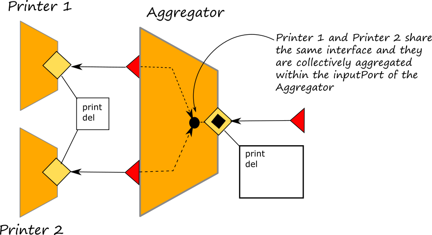

# Collections

A collection is a set of output ports that share the same interface. They can be used in combination with [Aggregation](https://github.com/jolie/docs/tree/f7380de3b4b0fc6b938ca43b657f4f0485963fdb/architectural-composition/aggreation.md) and [Couriers](couriers.md#courier-sessions) in order to public their interface into an aggregator and then forward the message to an output port of the collection depending on a specific rule.

## Smart Aggregations
Smart Aggregation allows to collectively aggregate outputPorts which share the same interface. Its syntax is very simple, it is sufficient to group the output ports with the same interface within curly brackets:

```text
inputPort AggregatorPort {
    Location: ...
    Protocol: ...
    Aggregates: 
        { outputPort_11, outputPort_12, ... },
        //  ...
        { outputPort_n1, outputPort_n2, ... },
}

/*
where outputPort_11 and outputPort_12 share the same interface and, 
outputPort_n1 and outputPort_n2 share another interface */
```

Once a message is received on the shared interface, a courier process can be executed for running specific logics for the message delivery. As an example let us consider the case of an aggregator which receives messages for two printers and it delivers the message by following a cyclic approach. In the following picture we report the architecture of the example, whereas the code can be found [here](https://github.com/jolie/examples/tree/master/04_architectural_composition/08_collection/01_smart_aggregation)



Note that at the input port of the Aggregator and the corresponding output ports of the two aggregated services appear as it follows:
```text
outputPort Printer1 {
Location: ...
Protocol: sodep
Interfaces: PrinterInterface
}

outputPort Printer2 {
Location: ...
Protocol: sodep
Interfaces: PrinterInterface
}

inputPort AggregatorInput {
Location: Location_Aggregator
Protocol: sodep
Aggregates: { Printer1, Printer2 }
Interfaces: AggregatorInterface
}
```
Then, in the courier process a simple algorithm which cyclically delivers the messages to the two interfaces, is defined as it follows:

```text
courier AggregatorInput {
	[ interface PrinterInterface( request ) ] {
		/* depending on the key the message will be forwared to Printer1 or Printer2 */
		println@Console( ">>" + global.printer_counter )();
		if ( (global.printer_counter % 2) == 0 ) {
				forward Printer1( request )
		} else {
				forward Printer2( request )
		}
		;
		synchronized( printer_count_write ) {
				global.printer_counter++
		}
	}
}
```
Note that the variable `global.printer_counter` is counting the message received for operations of interface `PrinterInterface`.


# Interface extension
Collections extend the Courier Sessions syntax by allowing a set of output ports that share the same interface to be extended by the same `interface_extender`,

```text
inputPort AggregatorPort {
    // Location definition
    // Protocol definition
    Aggregates: 
        { outputPort_11, outputPort_12, ... } with extender_id1,
        //  ...
        { outputPort_n1, outputPort_n2, ... } with extender_idn
}
```

then, in the courier definition, the forward statement specifies the corresponding output port to forward the message to.

```text
courier AggregatorPort {
    interface interface_id( request )[( response )] {
        // some code, if necessary
        // and eventually
        forward (outputPort_name( request ) | outputPort_name( request )( response ))
    }
}
```

Courier Sessions that use collections of output ports are called "smart aggregations".

## A comprehensive example

Let us modify the example shown in Couriers subsection. In this new scenario we have two printer services Printer1 and Printer2, and the fax service Fax which are part of our trusted intranet.

```text
// printer.iol
type PrintRequest:void {
    .job:int
    .content:string
}

interface PrinterInterface {
OneWay:
    print(PrintRequest), del(int)
}

// fax.iol
type FaxRequest:void {
    .destination:string
    .content:string
}

interface FaxInterface {
OneWay:
    fax(FaxRequest)
}
```

We deploy a service that aggregates Printer1, Printer2, and Fax to accept requests from external networks \(e.g., the Internet\), but we want to authenticate the external users that use Printer1's and Printer2's service.

```text
include "locations.iol"
include "printer.iol"
include "fax.iol"
include "console.iol"
include "logger.iol"

execution { concurrent }

type AuthenticationData:void {
    .key:string
}

interface extender AuthInterfaceExtender {
    RequestResponse:
        *(AuthenticationData)(void)
    OneWay:
        *(AuthenticationData)
}

interface AggregatorInterface {
    RequestResponse:
        get_key(string)(string)
}

outputPort Printer1 {
    Location: Location_Printer1
    Protocol: sodep
    Interfaces: PrinterInterface
}

outputPort Printer2 {
    Location: Location_Printer2
    Protocol: sodep
    Interfaces: PrinterInterface
}

outputPort Logger {
    Location: Location_Logger
    Protocol: sodep
    Interfaces: LoggerInterface
}

outputPort Fax {
    Location: Location_Fax
    Protocol: sodep
Interfaces: FaxInterface
}

inputPort AggregatorInput {
    Location: Location_Aggregator
    Protocol: sodep
    Interfaces: AggregatorInterface
    Aggregates: { Printer1, Printer2 } with AuthInterfaceExtender, Fax
}

courier AggregatorInput {
    [ interface PrinterInterface( request ) ] {
        if ( request.key == "0000" ) {
            log@Logger( "Request for printer service 1" );
            forward Printer1( request )
        } else if ( request.key == "1111" ) {
            log@Logger( "Request for printer service 2" );
            forward Printer2( request )
        } else {
            log@Logger( "Request with invalid key: " + request.key )
        }
    }

    [ interface FaxInterface( request ) ] {
        log@Logger( "Received a request for fax service" );
        forward ( request )
    }
}

init
{
    println@Console( "Aggregator started" )()
}

main
{
    get_key( username )( key ) {
        if ( username == "username1" ) {
            key = "0000"
        } else if ( username == "username2" ) {
            key = "1111"
        } else {
            key = "XXXX"
        };
        log@Logger( "Sending key for username " + username )
    }
}
```

Above, the aggregator exposes the inputPort `AggregatorInput` that aggregates the `Fax` service \(as is\) and `Printer1` and `Printer2` services. `Printer1`'s and `Printer2`'s operations types are extended by the `AuthInterfaceExtender`.

The comprehensive files of the example above can be downloaded from the following link:

[Aggregation and interface extender Code Example](https://github.com/jolie/docs/blob/master/files/architectural-composition/code/aggregation_code.zip)

