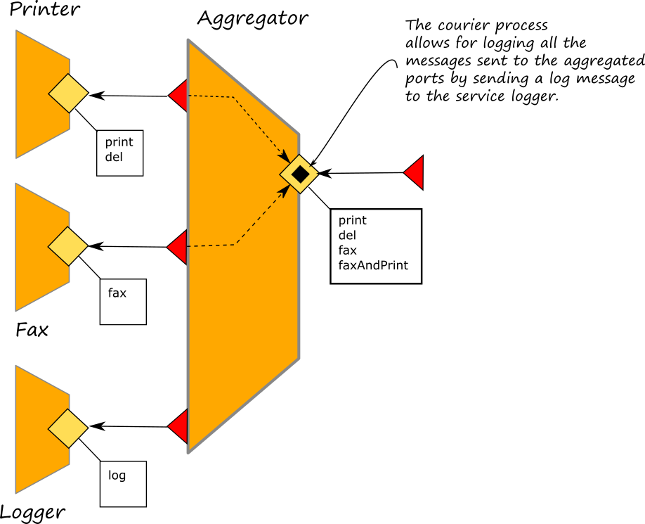

# Couriers

## Courier processes

Courier processes allow to enrich a service aggregation with context functionalities. They are joint to an aggregation operator and they are executed in between a message reception and its forwarding to the final target service. In a courier it is possible to program any kind of behaviour and they are usually exploited for managing all those functionalities which are not directly pertinent with the target service but they are usefull for the network context like authentication and logging.


In the diagram above, we represent a courier process as a black square within an inputPort. A courier process does not alter the connection topology of a circuit but it just enhances the capabilitites of an inputPort with a specific set of activities.

## The syntax
A courier process is defined in terms of a scope prefixed with the keyword `courier` followed by the name of the input port where attaching the courier process:

```text
courier <Name of the Input port> {
    ...
}
```
In the body of the scope, the list of the operations affected by the courier process must be defined. The list of operations follows this syntactical structure:

```text
courier <Name of the Input port> {
    [ <declaration of operation> ] {
       // code
    }
    
    [ <declaration of operation> ] {
       // code
    }
    
    [ <declaration of operation> ] {
       // code
    }
    
    ...
}
```
where the declaration of the operation can be twofold depending on the operation type: request response or one way:
```text
courier <Name of the Input port> {
    /* request response */
    [ operation_name( request )( response ) ] {
       // code of courier process executed for this operation
    }
    
    /* one way */
    [ operation_name( request ) ] {
        // code of courier process executed for this operation
    }
}
```

### The statement `forward` 
The statement `forward` can be used within the courier process code of each operation for delivering the message to the final target, as specified in the input port definition for the given operation. The syntax of the forward is very simple and it just follows the structure of the request response or the one way operation:

```text
courier <Name of the Input port> {
    /* request response */
    [ operation_name( request )( response ) ] {
       // code of courier process executed for this operation
       forward( request )( response )
    }
    
    /* one way */
    [ operation_name( request ) ] {
        // code of courier process executed for this operation
        forward( request )
    }
}
```

### Example
As an example, try to add the following courier process to the service aggregator of the example described in [Section Aggregation](./aggregation.md)

```jolie
courier Aggregator {
	[ print( request )( response ) ] {
		println@Console("Hello, I am the courier process")();
		forward( request )( response )
	}
}
```
Such a courier process is attached to port `Aggregator` and it is applied only on operation `print` which comes from the aggregated output port `Printer`. In the console of the service aggregator, as a result, you will see the string `Hello, I am the courier process` printed out every time the operation `print` is called. Ideally, the steps performed by the jolie engine of the service aggregator are the following ones:

- it receives a message for operation `print` on input port `Printer`
- it recongnized that there is a courier process attached for it
- it executes the courier process passing the request message into the request variable, in the example it is the variable `request`
- the courier process prints out the string `Hello, I am the courier process`
- the courier process forwards the request to the output port `Printer` executing the statement `forward`
- the courier process waits on the statement `forward` for a response from the printer service
- once the courier process receives the response it delivers it to the input port which forwards it to the initial caller

### Courier processes attached to interfaces
Sometimes it could happen that a courier process must be executed for all the operations of the same interface. In these cases could be quite annoying to list all the operations of that interface and write for each of them the same code. In Jolie it is possible to join a courier process to all the operations of a given interface. In this case the syntax is:

```text
courier <Name of the Input port> {
    /* all the request response operations of the interface*/
    [ interface interface_name( request )( response ) ] {
       // code of courier process executed for this operation
       forward( request )( response )
    }
    
    /* all the one way operations of the interface */
    [ interface interface_name( request ) ] {
        // code of courier process executed for this operation
        forward( request )
    }
}
```
Instead of specifying the name of the operations it is sufficient to use the keyword `interface` followed by the name of the interface. All the operations of that interface will be attached of the courier process defined in the body code. It is worth  noting that there are two different declarations for request response operationd and one way operations just because the formers deal woth both request and response messages whereas the latter only with the request one.

### Example
Here we extend the example presented in [Section Aggregation](./aggregation.md) by adding a logging service which is called into the couriers of the aggregator in order to log all the messages sent to the aggregator port. 



The complete code of the example can be checked [here](https://github.com/jolie/examples/tree/master/04_architectural_composition/06_aggregation/03_courier/01-Courier). In this case we add courier processes to the interfaces of the aggregated ports where, before forwarding the incoming messages to the target ports we call the logger service by sending the content of the message obtained with the operation `valueToPrettyString` of service [StringUtils](https://jolielang.gitbook.io/docs/standard-library-api/string_utils).

```text
courier Aggregator {
	[ interface PrinterInterface( request )( response ) ] {
		valueToPrettyString@StringUtils( request )( s );
		log@Logger( { .content = s } );
		forward( request )( response )
	}

	[ interface PrinterInterface( request ) ] {
		valueToPrettyString@StringUtils( request )( s );
		log@Logger( { .content = s }  );
		forward( request )
	}
}
```
It is worth noting that the output port of service Logger is just one of the output ports available within the service aggregator and it is normally defined like all the others.

```text
outputPort Logger {
	Location: Location_Logger
	Protocol: sodep
	Interfaces: LoggerInterface
}
```

Thus, a courier process can exploit all the available output ports of the service where it is defined for executing its activities.


## Interface extension
Interface extension is a feature of Jolie language which can be used jointly with courier processes in order to extend the message types of the operations of an aggregated port. The interface extension alters the final surface at the aggregating input port without affecting the aggregated one. 


Interface extension can be particularly useful when it is necessary to enrich the message types of an aggregated ports due to the presence of a courier process attached to it. It is worth noting that the courier process will manage request and response messages conformant to the extended interfaces, but it will **automatically** forward messages cleaned from the extended parts.

### How to define extension rules
`interface extender` is the keyword used in Jolie for defining the extending rules to overload the types of a given interface. The syntax follows.

```text
interface extender extender_id {
    OneWay: * | OneWayDefinition
    RequestResponse: * | RequestResponseDefinition
}
```

The `interface extender` associates an identifier \(`extender_id`\) to a set of extending rules which takes the form of a standard operation declaration with the exception of the usage of the token `*` for denoting _all the operations_.

As an example let us consider the following interface extender:

```text
type AuthenticationData: void {
    .key:string
}

interface extender AuthInterfaceExtender {
RequestResponse:
    *( AuthenticationData )( void ) throws KeyNotValid
}
```

This interface extender must be read in the following way:
* extends all the request response operations of a given interface with type `AuthenticationData` in request messages and type `void` in response messages. The `AuthenticationData` just adds a node `key:string` to each request message, whereas the type `void` does not actually alter the response messages. A new fault called `KeyNotValid` can be thrown by all the extended request response operations. In case we specify the name of the operation in the interface extender, the rule will be applied only to that operation. In the following example, the rule will be applied only to operations named `op1`.

```text
type AuthenticationData: void {
    .key:string
}

interface extender AuthInterfaceExtender {
RequestResponse:
    op1( AuthenticationData )( void ) throws KeyNotValid
}
```


### How to apply the extension rules
Interface extenders can only be applied to aggregated output ports. In order to do that the keyword `with` is used for associating an aggregated output port to an interface extender. The syntax follows:
  
```text
inputPort AggregatorPort {
    // Location definition
    // Protocol definition
    Aggregates: 
        { outputPort_1, outputPort_2, ... , outputPort_n } with extender_id1,
        //  ...
        outputPort_n+1 with extender_idn
}
```
Note that more than one input port can be extended with the same extender, in order to do that it is sufficient to group them into culry brackets (`{ outputPort_1, outputPort_2, ... , outputPort_n }`). Such a declaration is sufficient for applying the extension rules. It is worth noting that at the level of courier processes, the statement `forward` **will always erase** the extended part of the message before forwarding them to the target port.


## A comprehensive example

For a better understanding of how aggregation and interface extension work, let us consider a scenario where a fax service F is part of a trusted intranet, accepting requests coming from any intranet's user.

```text
// fax.iol
type FaxRequest:void {
    .destination:string
    .content:string
}

interface FaxInterface {
OneWay:
    fax(FaxRequest)
}
```

We can deploy a service that aggregates F in order to keep it unchanged and accept requests from external networks \(e.g., the Internet\). In this way, we allow external users to invoke F's services, but we introduce security concerns too. To keep the intranet trustworthy, we want to authenticate the external users that use F's service, hence we require additional information than the one needed by F's operations.

In this scenario the "simple" message-forwarding capability of the aggregation is not sufficient. The requests coming from external users cannot be directly forwarded to the aggregated services, as they require some sort of elaboration, which is achieved by extending the operations of the aggregated services in the aggregator.

```text
include "fax.iol"
include "console.iol"

execution { concurrent }

type AuthenticationData: void {
    .key:string
}

interface extender AuthInterfaceExtender {
    OneWay:
        *(AuthenticationData)
}

interface AggregatorInterface {
RequestResponse:
    get_key(string)(string)
}

outputPort Fax {
    Location: Location_Fax
    Protocol: sodep
    Interfaces: FaxInterface
}

inputPort AggregatorInput {
    Location: Location_Aggregator
    Protocol: sodep
    Interfaces: AggregatorInterface
    Aggregates: Fax with AuthInterfaceExtender
}

courier AggregatorInput {
    [interface FaxInterface( request )] {
        if ( key == "1111" ){
            forward ( request )
        }
    }
}

main
{
    get_key( username )( key ) {
        if ( username == "username" ) {
            key = "1111"
        } else {
            key = "XXXX"
        }
    }
}
```

In the example above, the aggregator exposes the inputPort `AggregatorInput` that aggregates the `Fax` service whose operations types are extended by the `AuthInterfaceExtender`.

`AuthInterfaceExtender` adds an additional node `key` of type `string` to each type of each operation.

The input port uses the field _Interfaces_ specifying the additional operation `get_key` that the aggregator provides on its own. That operation is invoked by a client requesting the authentication `key`. The `key` is sent back accordingly to the client's `username` and must be included by the client in every `FaxInterface`'s forward operation.

