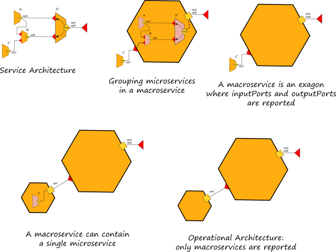

# Embedding

Embedding is a mechanism for executing multiple services within the same execution context. A service, called _embedder_, can _embed_ another service, called _embedded_ service, by targeting it with the `embedded` primitive.

The syntax for embedding is:

```text

embedded {
    Language : path [ in OutputPort ]
}
```

the embedding construct specifies the type \(`Language`\) of the service to embed, and `path` is a URL \(possible in simple form\) pointing to the definition of the service to embed. Jolie currently supports the embedding of services written with the following technologies: 

* `Jolie`: described in the section below;
* `Java`: go to section [Integration with other technologies/Java](../technology-integration/javaservices.md);
* `JavaScript`: go to section [Integration with other technologies/Javascript](../technology-integration/javascript.md).

Embedding may optionally specify an output port: in this case, as soon as the service is loaded and in case there is no location defined, the output port is bound to the _"local"_ communication input port of the embedded service. 

Embedding produces a hierarchy of services where the embedder is the parent service of embedded ones; this hierarchy handles termination: whenever a service terminates, all its embedded services are recursively terminated. The hierarchy is also useful for enhancing performances: services in the same virtual machines indeed, may communicate using fast local memory communication channels.

Command line parameters can also be passed within the embedding path. 

## Macroservices
Here we introduce the concept of _macroservice_ as a unique execution context for a set of microservices. One or more microservices can be executed within the same execution context. When there is only one microservice, the definition of a macroservice corresponds with the same of microservice. A macroservice exhibit only the public available ports of the inner microservices. The ports that are not reachable by external invokers are considered internal ports and they are hidden from the point of view of a macroservice. Operationally, a macroservice can be obtained by exploiting the embedding primitive.



Graphically they are represented with a orange exagon.

## Embedding Jolie Services

Let us consider the _twice_ service example given in [Behaviour and Deployment](https://jolielang.gitbook.io/docs/getting-started/behavior_and_deployment) sub-section.

First, we add the following input port to allow local communications:

```text
include "twiceInterface.iol"

inputPort LocalIn {
    Location: "local"
    Interfaces: TwiceInterface
}

main
{
    twice( number )( result ) {
        result = number * 2
    }
}
```

Afterwards, we can write a modified version of the client program which embeds the twice service and calls it using an output port bound by embedding. We assume that the embedded service is stored in `twice_service.ol`.

```text
include "twiceInterface.iol"
include "console.iol"

outputPort TwiceService {
    Interfaces: TwiceInterface
}

embedded {
    Jolie: "twice_service.ol" in TwiceService
}

main
{
    twice@TwiceService( 5 )( response );
    println@Console( response )()
}
```

When embedding a Jolie service, the path URL must point to a file containing a Jolie program \(provided as source code or in binary form\).


