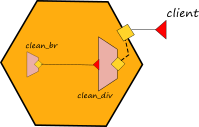
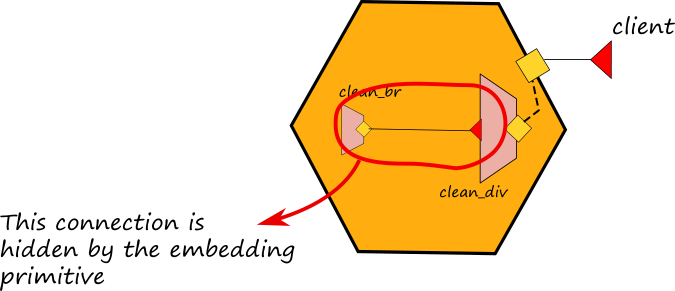

# Embedding

Embedding is a mechanism for executing multiple services within the same execution context. A service, called _embedder_, can _embed_ another service, called _embedded_ service, by targeting it with the `embedded` primitive.

The syntax for embedding is:

```text

embedded {
    Language : path [ in OutputPort ]
}
```

the embedding construct specifies the type \(`Language`\) of the service to embed, and `path` is a URL \(possible in simple form\) pointing to the definition of the service to embed. Jolie currently supports the embedding of services written with the following technologies:

* `Jolie`: described in the section below;
* `Java`: go to section [Integration with other technologies/Java](../technology-integration/javaservices.md);
* `JavaScript`: go to section [Integration with other technologies/Javascript](../technology-integration/javascript.md).

Embedding may optionally specify an output port: in this case, as soon as the service is loaded and in case there is no location defined, the output port is bound to the _"local"_ communication input port of the embedded service.

Embedding produces a hierarchy of services where the embedder is the parent service of embedded ones; this hierarchy handles termination: whenever a service terminates, all its embedded services are recursively terminated. The hierarchy is also useful for enhancing performances: services in the same virtual machines indeed, may communicate using fast local memory communication channels.

Command line parameters can also be passed within the embedding path.

## Macroservices
Here we introduce the concept of _macroservice_ as a unique execution context for a set of microservices. One or more microservices can be executed within the same execution context. When there is only one microservice, the definition of a macroservice corresponds with the same of microservice. A macroservice exhibit only the public available ports of the inner microservices. The ports that are not reachable by external invokers are considered internal ports and they are hidden from the point of view of a macroservice. Operationally, a macroservice can be obtained by exploiting the embedding primitive.


Graphically they are represented with a orange exagon.

## Embedding Jolie Services

Embedding Jolie services is very simple. In order to show how it works, let us consider a simple example whose executable code can be found [here](https://github.com/jolie/examples/tree/master/04_architectural_composition/01_embedding_jolie/01_embedding).

In this example we want to implement a service which is able to clean a html string from the tags `<div>`,  `</div>`, `<br>` and `</br>` replacing the br ones with a line feed and a carriage return. In order to do this, we implement a parent service called _clean_div.ol_ which is in charge to clean the div tags and another service called _clean_br.ol_ in charge to clean the br tags. The service _clean_div.ol_ embeds the service _clean_br.ol_:

```jolie
include "CleanBrInterface.iol"
include "CleanDivInterface.iol"

include "string_utils.iol"

execution{ concurrent }

outputPort CleanBr {
  Interfaces: CleanBrInterface
}

embedded {
  Jolie:
    "clean_br.ol" in CleanBr
}

inputPort CleanDiv {
  Location: "socket://localhost:9000"
  Protocol: sodep
  Interfaces: CleanDivInterface
}

main {
    cleanDiv( request )( response ) {
        replaceAll@StringUtils( request { .regex="<div>", .replacement="" })( request );
        replaceAll@StringUtils( request { .regex="</div>", .replacement="\n" })( request );
        cleanBr@CleanBr( request )( response )
    }
}

```


It is worth noting that:
* the outputPort _CleanBr_ does not define nor the location and the procolo because they are set by the embedding primitive with localtion "local" and inner memory protocol.
* the embedding primitive specifies the language "Jolie" because the service _clean_br.ol_ is written in Jolie
* the embedding primitive joins the service _clean_br.ol_ with the outputPort _CleanBr_ thus implying that each time we use port CleanBr inside the behaviour we will invoke the embedded service:

```jolie
cleanBr@CleanBr( request )( response )
```

### Hiding connections

Note that the embedding primitive, together with the usage of in-memory communication, allows for hiding connections among embedded microservices. In the example above the connection between the service _clean_div.ol_ and _clean_br.ol_ is hidden by the embedding and no external microservices can call the inputPort of the microservice _clean_br.ol_.



### Creating a script from a service architecture

Afterwards, we can write a modified version of the client program of the previous example, in order to directly embed the service _clean_dv.ol_ thus **transforming the service architecture into a single script**. The code of this example can be found [here](https://github.com/jolie/examples/tree/master/04_architectural_composition/01_embedding_jolie/02_script). Here we report the code of the script:

```text
include "CleanDivInterface.iol"
include "console.iol"

outputPort CleanDiv {
	Interfaces: CleanDivInterface
}

embedded {
Jolie:
	"clean_div.ol" in CleanDiv
}

main
{
	div = "<div>This is an example of embedding<br>try to run the encoding_div.ol<br>and watch the result.</div>";
	println@Console("String to be cleaned:" + div )();
	cleanDiv@CleanDiv( div )( clean_string );
	println@Console()();
	println@Console( "String cleaned:" + clean_string )()
}

```

It is worth noting that now the file _script.ol_ embeds the service _clean_div.ol_ which embeds the service _clean_br.ol_. Since _script.ol_ does not implement any inputPort but it just executes a script, when it reach the ends all the embedded services are automatically shut down.

## Dynamic Embedding

Dynamic embedding makes possible to associate a unique embedded instance to a single process of the embedder, thus allowing only that specific process to invoke the operations of the embedded service. Such a feature can be obtained by exploiting the API of the [runtime service](../standard-library-api/runtime), in particular we will use operation _loadEmbeddedService_.

As an example, let us consider a specification of a service that allows clients to start a timed-counter. The counter sends back to its invoker the value of an incremental count every second.

Firstly, let us implement the specification as an embeddeder with a `concurrent` behaviour, statically embedding a counter service. A new instance of the embedder is created each time a new client invokes the `startNewCounter` operation, but still the embedded service `CounterService` is instanced only once and it is shared among all instances of the embedder.

```text
/*
    part of deployment omitted
*/

outputPort CounterService{
    Interfaces: CounterInterface
}

embedded {
    Jolie: "CounterService.ol" in CounterService
}

execution{ concurrent }

main
{
    startNewCounter( location );
    CounterClient.location = location;
    println@Console( "New counter session started" )();
    start@CounterService();
    while( true ){
        inc@CounterService()( counterState );
        receiveCount@CounterClient( counterState );
        sleep@Time( 1000 )()
    }
}
```

Such an implementation is wrong because it diverges from the given specification.

`CounterService` is a singleton, its operations are accessed by any instance of the embedder, thus each instance of the embedder returns a "global" counting, instead of a single-instanced one.

We can achieve the right implementation by dynamically embedding the service.

```text
include "runtime.iol"

/*
    part of deployment omitted
*/

outputPort CounterService{
    Interfaces: CounterInterface
}

execution{ concurrent }

main
{
    startNewCounter( location );
    CounterClient.location = location;
    println@Console( "New counter session started" )();

    embedInfo.type = "Jolie";
    embedInfo.filepath = "CounterService.ol";
    loadEmbeddedService@Runtime( embedInfo )( CounterService.location );

    start@CounterService();
    while( true ){
        inc@CounterService()( counterState );
        receiveCount@CounterClient( counterState );
        sleep@Time( 1000 )()
    }
}
```

In the example above we include the `runtime.iol` library \(part of Jolie's standard library \) used for realizing the dynamic embedding. At Lines 15-17 we dynamically embed the service `CounterService` which creates a new instance of the embedded service each time a new instance of the embedder is started.

The comprehensive code examples of both the static \(wrong\) and dynamic embedding can be downloaded here:

[Dynamic Embedding Code Example](https://github.com/jolie/docs/blob/master/files/architectural-composition/code/dynamic_embedding_code.zip)

