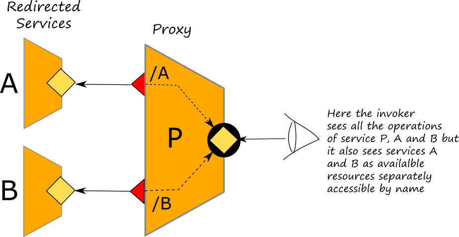
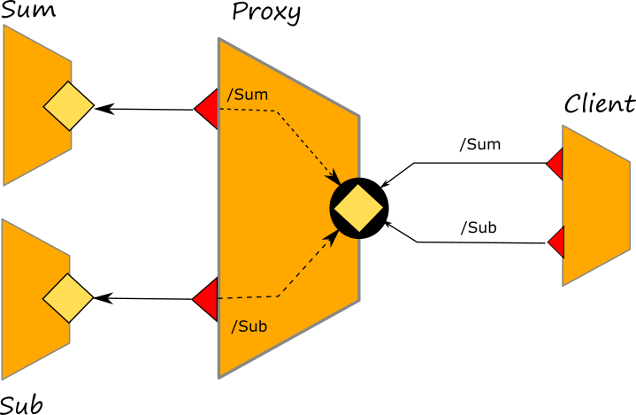

# Redirection

Redirection allows for the creation of a service, called _proxy_, acting as a single communication endpoint for multiple services, called _resources_. Similarly to an [aggregator](aggregation.md), a proxy receives all the messages meant for the system that it handles, but it transparently exposes the resource names of the redirected services. Redirection is syntactically obtained by binding an input port of the proxy service to multiple output ports, each one identifying a service by means of a _resource name_.



The main advantages of redirection are:

* the possibility to provide a unique access point to the system clients. In this way the services of the system could be relocated and/or replaced transparently to the clients;
* the possibility to provide transparent communication protocol transformations between the invoker and the master and the master and the rest of the system;

## The syntax
The syntax of redirection is:

```text

inputPort id {
    Location: URI
    Protocol: p
    Redirects:
        sid_1 => OP_id_1,
        //...
        sid_i => OP_id_i,
        //...
        sid_N => OP_id_N
}
```

where `sid_i => OP_id_i` associates a resource name `sid_i` to an output port identifier `OP_id_i`.

### How to add a resource name to a location
The resource name must be specified into the location of service to invoke within the output port. The syntax os very simple, it i sufficient to put the token `/!/` between the redirector location and the resource name. As an example let us consider the following locations:

* `socket://localhost:9000/!/A`: where `socket://localhost:9000` is the base location of the redirector port and `A` is the resource name of the target service.
* `socket://200.200.200.200:19000/!/MyService`: where `socket://200.200.200.200:19000` is the base location of the redirector port and `MyService` is the resource name of the target service.

## Example
In the following example we show a simple redirection scenario where a proxy provides a common endpoint for two services, _Sum_ and _Sub_, which performrs addiction and substraction respecitvely. At this [link](https://github.com/jolie/examples/tree/master/04_architectural_composition/07_redirection/01_static_redirection) it is possible to check the complete code.



The redirection is obtained by simply using the `Redirects` keyword as explained above:

```text
outputPort SubService {
Location: Location_Sub
Protocol: sodep
}

outputPort SumService {
Location: Location_Sum
Protocol: sodep
}

inputPort Redirector {
Location: Location_Redirector
Protocol: sodep
Redirects:
	Sub => SubService,
	Sum => SumService
}
```

It is worth noting that, differently from an aggregation scenario where the client just uses a unique output port for sending messages to the target service, here the client has two output ports, one for the service _Sum_ and one for the service _Sub_.

```text
outputPort Sub {
  Location: "socket://localhost:9000/!/Sub"
  Protocol: sodep
  Interfaces: SubInterface
}

outputPort Sum {
  Location: "socket://localhost:9000/!/Sum"
  Protocol: sodep
  Interfaces: SumInterface
}
```

## Dynamic Redirection

Redirection can be changed dynamically by simply modifying the outputPort location via dynamic port binding.

```text
include "console.iol"
include "ui/ui.iol"
include "ui/Swing_ui.iol"

outputPort SubService {
Location: "socket://localhost:2000/"
Protocol: soap
}

outputPort SumService {
Location: "socket://localhost:2001/"
Protocol: soap
}

inputPort MyService {
Location: "socket://localhost:2002/"
Protocol: sodep
Redirects:     
    Sub => SubService,
    Sum => SumService    
}

main
{    
    keepRunning = true;
    while ( keepRunning ) {
        showInputDialog@SwingUI( "available commands: " +
            "relocateSum, relocateSub, exit." )( command );
        if ( command == "relocateSum" ) {
            showInputDialog@SwingUI( "The current service location is: " +
                SumService.location + 
                "nInsert the new 'SumService' location" )( location );
            SumService.location = location;
            println@Console( "New location set for SumService: " + 
                SumService.location )()
        };
        if ( command == "relocateSub" ) {
            showInputDialog@SwingUI( "The current service location is: " +
                SubService.location + 
                "nInsert the new 'SubService' location" )( location );
            SubService.location = location;
            println@Console( "New location set for SubService: " +
                SubService.location )()
        };
        if ( command == "exit" ) {
            keepRunning = false
        }
    }
}
```

