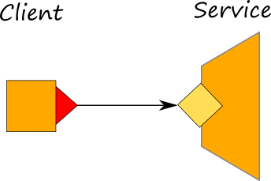

# Creating a Service and a Client

Now we want to create a server that provides a service to double a number. We also create a client for that service.



## Server's code

```jolie
inputPort TwiceService {
    Location: "socket://localhost:8000"
    Protocol: sodep
    RequestResponse: twice
}

main
{
    twice( number )( result ) {
        result = number * 2
    }
}
```

The behaviour of the server starts with an input on operation `twice`, storing the received message in variable `number`. Thereafter, it stores in variable `result` the value of `number` multiplied by 2. Finally, the value of `result` is sent back to the invoker of `twice`.

## Client's code

```jolie
include "console.iol"

outputPort TwiceService {
    Location: "socket://localhost:8000"
    Protocol: sodep
    RequestResponse: twice
}

main
{
    twice@TwiceService( 5 )( response );
    println@Console( response )()
}
```

The behaviour of the client is complementary to that of the server: it invokes the operation `twice` exposed by the server, passing the number 5 as the invocation value. After sending the request to the server, the client will wait to receive a response, stored in the variable `response`. Finally, the result is printed on screen. Note that also `println` is a service, provided by the Console server, part of the Jolie Standard Library.

The two programs must be run in two separate terminal sessions. As expected, first we start `service.ol`, which waits for clients to invoke it, and then we start the `client.ol`.

A complete example can be downloaded here: [Creating a service and a client](https://github.com/jolie/examples/tree/master/01_getting_started).

## Important: enabling the communication by using ports

To enable a communication between a server and a client, we need to specify the input and the output endpoints. In Jolie we do this by using primitives _input ports_ and _output ports_. The inputPort is used for defining a listener endpoint whereas the outputPort is used for sending messages to an inputPort. In our case, the inputPort will be defined on the service side whereas the outputPort will be defined on the client side.

### Service inputPort

```jolie
inputPort TwiceService {
    Location: "socket://localhost:8000"
    Protocol: sodep
    RequestResponse: twice
}
```

### Client outputPort

```jolie
outputPort TwiceService {
    Location: "socket://localhost:8000"
    Protocol: sodep
    RequestResponse: twice
}
```

Ports are based upon the three fundamental concepts of _location_, _protocol_, and _supported operations_. The former two define the concrete binding information between a Jolie program and other services. The last, instead, defines the list of the available operations at the given port.

In particular, a location, e.g. a TCP/IP address, expresses the communication medium that a service uses for exposing its interface or contacting another service. A protocol defines how data to be sent or received should be encoded \(output\) or decoded \(input\).

