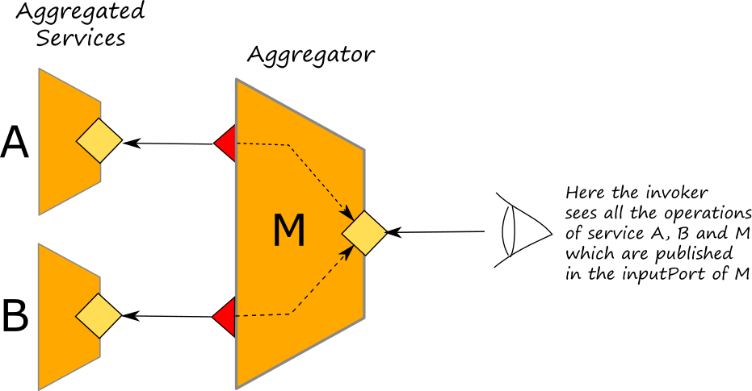
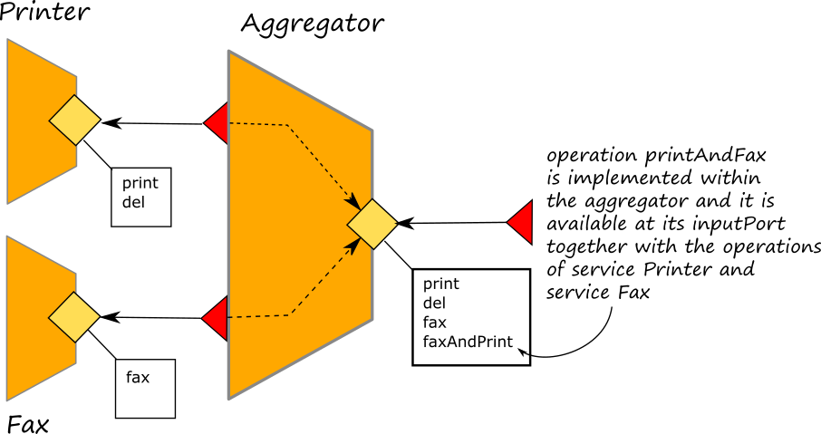
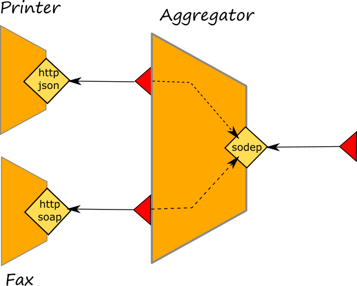

# Aggregation

The _Aggregation_ is an architectural operator between an inputPort and a set of outpurPorts which allows for composing services in a way that the API of the aggregated services are merged with those of the aggregator. It is a generalisation of network proxies that allow a service to expose operations without implementing them in its behaviour, but delegating them to other services. Aggregation can also be used for programming various architectural patterns, such as load balancers, reverse proxies, and adapters.

The syntax for aggregation extends that given for input ports.

```jolie
inputPort id {
    Location: URI
    Protocol: p
    Interfaces: iface_1, ..., iface_n
    [ Aggregates: outputPort_1, outputPort_2, ... ]
}
```

Where the `Aggregates` primitive expects a list of output port names.



If we observe the list of the operations available at the inputPort of the aggregator, we will see the list of all the aggregated operations together with those of the aggregator.

## How Aggregation works

We can now define how aggregation works. Given IP as an input port, whenever a message for operation OP is received through IP, we have three scenarios:

* OP is an operation declared in one of the interfaces of IP. In this case, the message is normally received by the program.
* OP is not declared in one of the interfaces of IP and is declared in the interface of an output port \(OP\_port\) aggregated by IP. In this case the message is forwarded to OP\_port port as an output from the aggregator.
* OP is not declared in any interface of IP or of its aggregated output ports. Then, the message is rejected and an `IOException` fault is sent to the caller.

We can observe that in the second scenario aggregation _merges_ the interfaces of the aggregated output ports and makes them accessible through a single input port. Thus, an invoker would see all the aggregated services as a single one.

Remarkably, aggregation handles the request-response pattern seamlessly: when forwarding a request-response invocation to an aggregated service, the aggregator will automatically take care of relaying the response to the original invoker.

As an example let us consider the case of two services, the printer and fax, aggregated into one service which also add another operation called _faxAndPrint_. The code may be consulted [here](https://github.com/jolie/examples/tree/master/04_architectural_composition/06_aggregation/01_aggregation_and%20orchestration).



The service _printer_ offers two operations called _print_ and _del_. The former allows for the printing of a document whereas the latter allows for its deletion from the queue. On the other hand the service _fax_ offers just one operation called _fax_. The aggregator, aggregates on its inputPort called _Aggregator_ both the printer and fax services as it is shown below where we report the ports declaration of the aggregator service:

```jolie
include "printer.iol"
include "fax.iol"

type FaxAndPrintRequest: void {
    .fax: FaxRequest
    .print: PrintRequest
}

interface AggregatorInterface {
    RequestResponse:
        faxAndPrint( FaxAndPrintRequest )( void ) throws Aborted
}


outputPort Printer {
Location: "socket://localhost:9000"
Protocol: sodep
Interfaces: PrinterInterface
}

outputPort Fax {
Location: "socket://localhost:9001"
Protocol: sodep
Interfaces: FaxInterface
}

inputPort Aggregator {
Location: "socket://localhost:9002"
Protocol: sodep
Interfaces: AggregatorInterface
Aggregates: Printer, Fax
}
```

It is worth noting that the inputPort _Aggregator_ actually offers all the operations available at outputPorts _Printer_ and _Fax_ which are connected with service _printer_ and _fax_ respectively. Moreover, the same inputPort declares also to make available the operations defined into interface _AggregatorInterface_ where one operation is defined: _faxAndPrint_. As a result, the following operations are available at the inputPort _Aggregator_:

* _print_: which is executed by service _printer_;
* _del_: which is executed by service _printer_;
* _fax_: which is executed by service _fax_;
* _faxAndPrint_: which is executed by the aggregator

In particular, let us notice that the operation _faxAndPrint_ actually orchestrates the operations _print_ and _fax_ in order to provide a unique operation which executes both of them.

## The Surface

Here we introduce the concept of surface that is quite similar to that of _interface_ but with some important differences.

A _surface_ is the resulting interface available at a given input port.

```jolie
interface A { ... }
interface B { ... }
interface C { ... }
interface D { ... }

outputPort Aport {
  Interfaces: A
}

outputPort Bport {
  Interfaces: B
}


inputPort MyInput {
    ...
    Interfaces: C, D
    Aggregates: Aport, Bport
}
```

In this example there are four interfaces declared: interface _A_, interface _B_, interface _C_ and interface _D_ and there are two outputPorts _Aport_ and _Bport_. The former exploits interface _A_ whereas the latter interface _B_. There is only one inputPort called _MyInput_ which aggregated both the output ports and also offers interfaces _A_ and _B_.

In this case the surface at input port _MyInput_ is the resulting interface of the composition of interfaces _A_, _B_, _C_ and _D_.

A surface is always obtained by listing all the available operations and types of all the interfaces available at a given input port. Thus if we calculate the surface of the port _Aggregator_ dicussed in the previous section we will obtain the following one:

```jolie
type JobID:void{
    .jobId:string
}

type FaxAndPrintRequest:void{
    .print:PrintRequest
    .fax:FaxRequest
}
type PrintRequest:void{
    .content:string
}
type PrintResponse:JobID
type FaxRequest:void{
    .destination:string
    .content:string
}


interface AggregatorSurface {
OneWay:
    del( JobID )
RequestResponse:
    faxAndPrint( FaxAndPrintRequest )( void ) throws Aborted( undefined ),
    print( PrintRequest )( PrintResponse ),
    fax( FaxRequest )( void )
}
```

The surface can be included by an invoker service for getting all the available operations for invoking the port _Aggregator_.

### jolie2surface

One important characteristic of the surface is that it actually does not exist as a software artifact until it is automatically derived and created from an input port declaration. So, how could we create a surface?

The Jolie installation is equipped with a tool called _jolie2surface_ which allows for the creation of a surface starting from a service definition. Its usage is very simple, it is sufficient to run the following command:

```text
jolie2surface <filename.ol> <name of the port>
```

in order to obtain the surface of port _Aggregator_ discussed in the previous section, the command is:

```text
jolie2surface aggregator.ol Aggregator
```

if you need to save it into a file, just redirects the standard output:

```text
jolie2surface aggregator.ol Aggregator > surface.iol
```

Note that the tool _jolie2surface_ also adds the outputPort declaration connected to the input port.

### Extracting surface programmatically

The surface can be extracted in a programmatic way too by exploiting the standard library of Jolie. In particular, we can use the services [MetaJolie](https://jolielang.gitbook.io/docs/standard-library-api/metajolie) and [MetaParser](https://jolielang.gitbook.io/docs/standard-library-api/metaparser) for getting the surface of a an input port of a service.  
The service _MetaJolie_ provides a set of functionalities for getting important meta information about a service whereas the service _MetaParser_ provides for transforming these information into a syntactically correct Jolie definition. If we want to extract the surface of an input port we can use the operation _getInputPortMetaData@MetaJolie_ which returns a complete description of the input port of a service definition. Then, with the operation _getSurface@Parser_ we can extract the surface by passing the definition of the input port obtained from the previous operation.

In the following you can find the example of the programmatic surface extraction of service _aggregator.ol_.

```jolie
include "metajolie.iol"
include "metaparser.iol"
include "console.iol"

main {
    getInputPortMetaData@MetaJolie( { .filename = "aggregator.ol" } )( meta_description );
    getSurface@Parser( meta_description.input[ 0 ] )( surface );
    println@Console( surface )()
}
```

The executable code can be found at this [link](https://github.com/jolie/examples/tree/master/04_architectural_composition/06_aggregation/06_surface_extraction)

## Protocol Transformation

Aggregation can be used for system integration, e.g., bridging services that use different communication technologies or protocols. As an example, let us consider the system discussed in the previous section but considering that the aggregated services offers they operation using different protocols like http/json and http/soap as depicted in the following picture:



In this case the aggregator automatically transforms the messages thus enabling a transparent composition of services which exploit different protocols.

The full executable example can be found [here](https://github.com/jolie/examples/tree/master/04_architectural_composition/06_aggregation/07_protocol_transformation). Here we report the input ports of both the fax and the printer services, and the output ports of the aggregator together with its main input port.

```jolie
// Fax Service
inputPort FaxInput {
Location: "socket://localhost:9001"
Protocol: soap { .wsdl = "fax.wsdl" }
Interfaces: FaxInterface
}

// Printer Service
inputPort PrinterInput {
Location: "socket://localhost:9000"
Protocol: http { .fomat = "json" }
Interfaces: PrinterInterface
}

// Aggregator
outputPort Printer {
Location: "socket://localhost:9000"
Protocol: http { .fomat = "json" }
Interfaces: PrinterInterface
}

outputPort Fax {
Location: "socket://localhost:9001"
Protocol: soap { .wsdl = "fax.wsdl" }
Interfaces: FaxInterface
}

inputPort Aggregator {
Location: "socket://localhost:9002"
Protocol: sodep
Interfaces: AggregatorInterface
Aggregates: Printer, Fax
}
```

