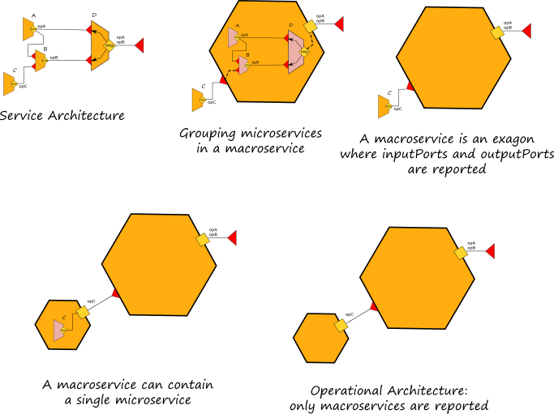
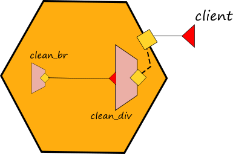
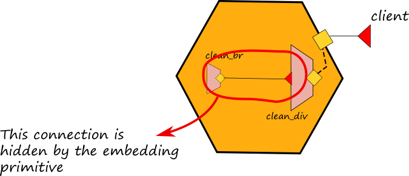

# Embedding

Embedding is a mechanism for executing multiple services within the same execution context. A service, called _embedder_, can _embed_ another service, called _embedded_ service, by targeting it with the `embedded` primitive.

The syntax for embedding is:

```jolie
embedded {
    Language : path [ in OutputPort ]
}
```

the embedding construct specifies the type \(`Language`\) of the service to embed, and `path` is a URL \(possible in simple form\) pointing to the definition of the service to embed. Jolie currently supports the embedding of services written with the following technologies:

* `Jolie`: described in the section below;
* `Java`: go to section [Integration with other technologies/Java](../technology-integration/java/javaservices.md);
* `JavaScript`: go to section [Integration with other technologies/Javascript](../technology-integration/javascript.md).

Embedding may optionally specify an output port: in this case, as soon as the service is loaded and in case there is no location defined, the output port is bound to the _"local"_ communication input port of the embedded service.

Embedding produces a hierarchy of services where the embedder is the parent service of embedded ones; this hierarchy handles termination: whenever a service terminates, all its embedded services are recursively terminated. The hierarchy is also useful for enhancing performances: services in the same virtual machines indeed, may communicate using fast local memory communication channels.

Command line parameters can also be passed within the embedding path.

## Macroservices

Here we introduce the concept of _macroservice_ as a unique execution context for a set of microservices. One or more microservices can be executed within the same execution context. When there is only one microservice, the definition of a macroservice corresponds with the same of microservice. A macroservice exhibit only the public available ports of the inner microservices. The ports that are not reachable by external invokers are considered internal ports and they are hidden from the point of view of a macroservice. Operationally, a macroservice can be obtained by exploiting the embedding primitive.



Graphically they are represented with a orange exagon.

## Embedding Jolie Services

Embedding Jolie services is very simple. In order to show how it works, let us consider a simple example whose executable code can be found [here](https://github.com/jolie/examples/tree/master/04_architectural_composition/01_embedding_jolie/01_embedding).

In this example we want to implement a service which is able to clean a html string from the tags `<div>`, `</div>`, `<br>` and `</br>` replacing the br ones with a line feed and a carriage return. In order to do this, we implement a parent service called _clean\_div.ol_ which is in charge to clean the div tags and another service called _clean\_br.ol_ in charge to clean the br tags. The service _clean\_div.ol_ embeds the service _clean\_br.ol_:

```jolie
include "CleanBrInterface.iol"
include "CleanDivInterface.iol"

include "string_utils.iol"

execution{ concurrent }

outputPort CleanBr {
  Interfaces: CleanBrInterface
}

embedded {
  Jolie:
    "clean_br.ol" in CleanBr
}

inputPort CleanDiv {
  Location: "socket://localhost:9000"
  Protocol: sodep
  Interfaces: CleanDivInterface
}

main {
    cleanDiv( request )( response ) {
        replaceAll@StringUtils( request { .regex="<div>", .replacement="" })( request );
        replaceAll@StringUtils( request { .regex="</div>", .replacement="\n" })( request );
        cleanBr@CleanBr( request )( response )
    }
}
```



It is worth noting that:

* the outputPort _CleanBr_ does not define nor the location and the procolo because they are set by the embedding primitive with localtion "local" and inner memory protocol.
* the embedding primitive specifies the language "Jolie" because the service _clean\_br.ol_ is written in Jolie
* the embedding primitive joins the service _clean\_br.ol_ with the outputPort _CleanBr_ thus implying that each time we use port CleanBr inside the behaviour we will invoke the embedded service:

```jolie
cleanBr@CleanBr( request )( response )
```

### Hiding connections

Note that the embedding primitive, together with the usage of in-memory communication, allows for hiding connections among embedded microservices. In the example above the connection between the service _clean\_div.ol_ and _clean\_br.ol_ is hidden by the embedding and no external microservices can call the inputPort of the microservice _clean\_br.ol_.



### Creating a script from a service architecture

Afterwards, we can write a modified version of the client program of the previous example, in order to directly embed the service _clean\_dv.ol_ thus **transforming the service architecture into a single script**. The code of this example can be found [here](https://github.com/jolie/examples/tree/master/04_architectural_composition/01_embedding_jolie/02_script). Here we report the code of the script:

```jolie
include "CleanDivInterface.iol"
include "console.iol"

outputPort CleanDiv {
    Interfaces: CleanDivInterface
}

embedded {
Jolie:
    "clean_div.ol" in CleanDiv
}

main
{
    div = "<div>This is an example of embedding<br>try to run the encoding_div.ol<br>and watch the result.</div>";
    println@Console("String to be cleaned:" + div )();
    cleanDiv@CleanDiv( div )( clean_string );
    println@Console()();
    println@Console( "String cleaned:" + clean_string )()
}
```

It is worth noting that now the file _script.ol_ embeds the service _clean\_div.ol_ which embeds the service _clean\_br.ol_. Since _script.ol_ does not implement any inputPort but it just executes a script, when it reach the ends all the embedded services are automatically shut down.

## Dynamic Embedding

Dynamic embedding makes possible to associate a unique embedded instance to a single process of the embedder, thus allowing only that specific process to invoke the operations of the embedded service. Such a feature can be obtained by exploiting the API of the [runtime service](https://github.com/jolie/docs/tree/587adabef2f2169959f76fa242c1696673e54617/standard-library-api/runtime/README.md), in particular we will use operation _loadEmbeddedService_.

As an example let us consider the case of a calculator which offers the four arithmetic operators but it loads the implementation of them at runtime depending on the request selection. If the client specifies to perform a sum, the calculator will load the service which implements the sum and it will call it on the same operation _run_. The full code of the example can be found [here](https://github.com/jolie/examples/tree/master/04_architectural_composition/05_dynamic_embedding/calculator), in the following we report the code of the calculator:

```jolie
include "runtime.iol"

include "OperationInterface.iol"
include "CalculatorInterface.iol"

execution{ concurrent }

/* common interface of the embedded services */
outputPort Operation {
  Interfaces: OperationInterface
}

inputPort Calculator {
  Location: "socket://localhost:8000"
  Protocol: sodep
  Interfaces: CalculatorInterface
}

define __embed_service {
    with( emb ) {
      .filepath = __op + ".ol";
      .type = "Jolie"
    };
    /* this is the Runtime service operation for dynamic embed files */
    loadEmbeddedService@Runtime( emb )( Operation.location );

    /* once embedded we call the run operation */
    run@Operation( request )( response )
}

main {
  [ sum( request )( response ) {
      __op = "sum";
      /* here we call the define __embed_service where the variable __p is the name of the operation */
      __embed_service
  }]

  [ mul( request )( response ) {
      __op = "mul";
      __embed_service
  }]

  [ div( request )( response ) {
      __op = "div";
      __embed_service
  }]

  [ sub( request )( response ) {
    __op = "sub";
    __embed_service
  }]
}
```

The definition _embed\_service_ it is called within each operation offered by the calculator \(_sum_, _sub_, _mul_, _div_\) and it loads the specific service dynamically. Note that in this example the service files are named with the same name of the operations, thus there are the following files in the same folder of _calculator.ol_: _sum.ol_, _sub.ol_, _mul.ol_, _div.ol_. Each of them implement the same interface with different logics, thus they are polymorphic with respect the following interface:

```jolie
type RequestType: void {
  .x: double
  .y: double
}

interface OperationInterface {
  RequestResponse:
    run( RequestType )( double )
}
```

It is worth noting that the embedded service is running once for each enabled session then it expires. Thus each call produce a new specific embedding for that call.

