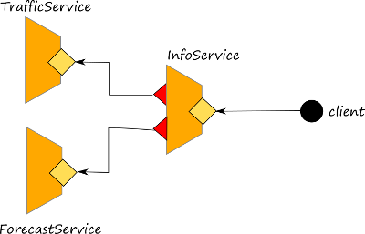

# Composing Statements

## Composing Statements

### Defining a Jolie application behaviour

The behaviour of a Jolie application is defined by conditions, loops, and statement execution rules.

Whilst conditions and loops implement the standard conditional and iteration constructs, execution rules defines the priority among code blocks.

## Behavioural operators

Jolie offers three kinds of operators to compose statements in sequence, parallel, or as a set of input choices.

### Sequence

The sequence operator `;` denotes that the left operand of the statement is executed _before_ the one on the right. The sequence operator syntax is:

```jolie
statementA ; statementB
```

A valid use of the sequence operator is as it follows:

```jolie
main
{
    print@Console( "Hello, " )();
    println@Console( "world!" )()
}
```

In practice, the `;` is used only when composing sequences in a single line of code, since newlines are interpreted as `;`. The code from before can be rewritten as:

```jolie
main
{
    // This is interpreted as a sequence
    print@Console( "Hello, " )()
    println@Console( "world!" )()
}
```

**Attention.** Keep in mind that, in Jolie, `;` is NOT the "end of statement" marker. For the sake of clarity, let us consider an INVALID use of the sequence operator:

```jolie
main
{
    print@Console( "Hello, " )();
    println@Console( "world!" )(); // Invalid usage of ;
}
```

### Parallel

The parallel operator `|` states that both left and right operands are executed _concurrently_. The syntax of the parallel operator is:

```jolie
statementA | statementB
```

It is a good practice to explicitly group statements when mixing sequence and parallel operators. Statements can be grouped by enclosing them within an unlabelled [scope](https://jolielang.gitbook.io/docs/fault-handling/basics) represented by a pair curly brackets `{}`, like in the following example:

```jolie
{ statementA ; statementB ; ... ; statementF }
|
{ statementG ; statementH }
```

The parallel operator has always priority on the sequence one, thus the following code snippets are equivalent:

```jolie
A ; B | C ; D
```

```jolie
{A ; B} | {C ; D}
```

Parallel execution is especially useful when dealing with multiple services, in order to minimize waiting times by managing multiple communications at once.

In this example we consider the scenario where there are three services:

* trafficService: it provides information about traffic for a given city
* forecastServyce: it provides information about forecasts for a given city \(in the specific case it just provides the current temperature\)
* infoService: it concurrently retrieves information from both the forecast and the  traffic service:



The behaviour of the InfoService is reported below. It is worth noting that the parallel operator combines the two calls to the other services, and the responses are stored into subnodes response.temperature and response.traffic, respectively.

```jolie
main {
  getInfo(request)(response) {
    getTemperature@Forecast( request )( response.temperature )
    |
    getData@Traffic( request )( response.traffic )
  };
  println@Console("Request served!")()
}
```

[Click here to get the comprehensive code of the example above.](https://github.com/jolie/examples/tree/master/02_basics/3_parallel)

Concurrent access to shared variables can be restricted through [synchronized](https://jolielang.gitbook.io/docs/basics/processes) blocks.

## Statements

### Input choice

The input choice implements **input-guarded choice**. Namely, it supports the receiving of a message for any of the statements in the choice. When a message for an input statement `IS_i` can be received, then all the other branches are deactivated and `IS_i` is executed. Afterwards, the related branch behaviour `branch_code_1` is executed. A static check enforces all the input choices to have different operations, so to avoid ambiguity.

The syntax of an input choice is:

```jolie
[ IS_1 ] { branch_code_1 }
[ IS_i ] { branch_code_i }
[ IS_n ] { branch_code_n }
```

Let us consider the example below in which only `buy` or `sell` operation can execute, while the other is discarded.

```jolie
[ buy( stock )( response ) {
    buy@Exchange( stock )( response )
} ] { println@Console( "Buy order forwarded" )() }

[ sell( stock )( response ) {
    sell@Exchange( stock )( response )
}] { println@Console( "Sell order forwarded" )() }
```

Note that input choice are used also as the first statement of the behaviour in order to specify all the available operations for that service. In this case all the operations are available to be called from external clients. In the link below we modified the example presented in the previous section \(Parallel\) where in the forecast service we specify two operations inside a input choice. [Click here to get the example code.](https://github.com/jolie/examples/tree/master/02_basics/2_input_choice)

### Conditions and conditional statement

Conditions are used in control flow statements in order to check a boolean expression. Conditions can use the following relational operators:

* `==`: is equal to;
* `!=`: is not equal to;
* `<`: is lower than;
* `<=`: is lower than or equal to;
* `>`: is higher than;
* `>=`: is higher than or equal to;
* `!`: negation

Conditions can be used as expressions and their evaluation always returns a boolean value \(true or false\). That value is the argument of conditional operators.

Some valid conditions are:

```jolie
x == "Hi"
!x
25 = 10
```

The statement `if ... else` is used to write deterministic choices:

```jolie
if ( condition ) {
    ...
} [else {
    ...
}]
```

Note that the `else` block is optional \(denoted by its enclosure in square brackets\).

Like in many other languages, the `if ... else` statement can be nested and combined:

```jolie
if ( !is_int( a ) ) {
    println@Console( "a is not an integer" )()
} else if ( a > 50 ) {
    println@Console( "a is major than 50" )()
} else if ( a == 50 ) {
    println@Console( "a is equal to 50" )()
} else {
    println@Console( "a is minor than 50" )()
}
```

### for and while

The `while` statement executes a code block as long as its condition is true.

```jolie
while( condition ) {
    ...
}
```

Like the `while` statement, `for` executes a code block as long as its condition is true, but it explicitly defines its initialization code and the post-cycle code block, which is executed after each iteration.

```jolie
for( init-code-block, condition, post-cycle-code-block ) {
    ...
}
```

Example:

```jolie
include "console.iol"

main {
    for( i = 0, i < 10, i++ ) {
        println@Console( i )()
    }
}
```

#### Iterating over arrays

**Attention.** Arrays and the `#` operator are explained in detail in the [Data Structures](https://jolielang.gitbook.io/docs/basics/data_structures) section.

Another form of `for` loops is the following, which iterates over all elements of an array `a`.

```jolie
for( element in a ) {
    println@Console( element )()
}
```

This is equivalent to the following code, but it is much less error-prone, so it is recommended to use the code above instead of the one below.

```jolie
for( i = 0, i < #a, i++ ){
    println@Console( a[i] )
}
```

