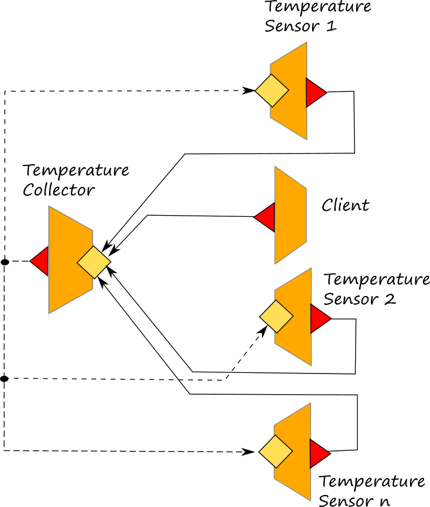
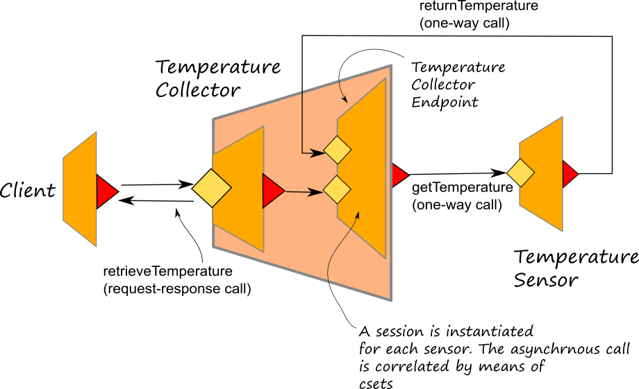

# Dynamic Parallel

## Dynamic Parallel

In Jolie, dynamic parallelism can be used for instantiating parallel activities within a service behaviour. It is achieved by using the primitive _spawn_ but, differently from the [parallel](https://jolielang.gitbook.io/docs/basics/composing_statements#parallel) operator which allows for the parallel composion of statically defined activities, the spawn primitive permits to design a set of parallel activities whose number is defined at runtime.

The syntax of the spawn follows:

```jolie
spawn( var over range ) in resultVar {
    spawned session
}
```

where _var_ is the index variable which ranges over _range_. _resultVar_ is the variable vector which will containt all the results from each spawned activity. _spawn session_ represents the session code to be executed in parallel for each spawn instantiation.

**Semantics** The execution of a spawn statement is completed when all its spawned sessions are completed. All the spawned sessions must be considered as common_service sessions_ instantiated by the spawn primitive and executed in parallel under the following conditions:

* they cannot contain input operations, thus they cannot receive messages from an external service \(with the exception of the response messages of solicit responses\). 
* they can be instantiated only by means of the spawn primitive
* they cannot exploit correlation sets
* they inherit all the variable values and the outputPort declarations of the current service session which is executing the spawn
* as usual sessions, all the variables they manage are local to the scope of the spawned session
* they can exploit global variables. Note that global variables are in common to all the sessions of the service

## Example: Temperature Average

In the following example whose code can be found at this [link](https://github.com/jolie/examples/tree/master/02_basics/9_dynamicparallel/1_temperature_average), the spawn primitive is used for collecting the temperature read from a bunch of sensors. This is the case of a IoT scenario, where several sensors are placed in different places of a building. Each sensor is modelled with a specific service called _temparature\_sensor.ol_ which just returns the current temperature at that node. The service _temperature\_collector.ol_ is a central service able to communicate with all the sensors. Each sensor registers itself to the central collector during the _init_.



In the following, we report the implementation of the operation _getAverageTemperature_ which exploits the primitive _spawn_ for collecting the temperatures reading from the sensors.

```jolie
    [ getAverageTemperature( request )( response ) {
        index = 0;
        foreach( sensor : global.sensor_hashmap ) {
            /* creates the vector for ranging over in the spawn primitive */
            sensor_vector[ index ] << global.sensor_hashmap.( sensor );
            index++
        };
        /* calling the spawn primitive */
        spawn( i over #sensor_vector ) in resultVar {
            scope( call_sensor ) {
                install( IOException =>
                    /* de-register a sensor if it does not respond */
                    undef( global.sensor_hashmap.( sensor_vector[ i ].id ) )
                );
                Sensor.location = sensor_vector[ i ].location;
                getTemperature@Sensor()( resultVar )
            }
        }
        ;
        /* calculate the average */
        for( y = 0, y < #resultVar, y++ ) {
            total = total + resultVar[ y ]
        };
        response = total / #resultVar
    }]
```

All the locations of the sensors are stored into the global hashmap called _sensor\_hashmap_. Before calling the spawn primitive the vector _sensor\_vector_ is prepared to keep all the necessary information about each sensor. In each spawn session the variable _i_, which ranges overe the size of the vector _sensor\_vector_, takes the value of the current spawn session, thus it is possible to bind the outputPort _Sensor_ to each different sensor location.

The results are stored into variable _resultVar_ which is a vector where, at each index, stores the response of the _i-th_ sensor. Finally, the calculation of the average temperature is very easy to be made.

It is worth noting that each spawn session must be considered as a separate session with its own local variables, thus the location of the port _Sensor_ can be bound separately from the others spawned sessions because its value is local and independent. At the same time all the variables of the parent session are available to be used \(e.g. _sensor\_vector_.

### Advanced usage of the spawn primitive

The previous example has been modified at this [link](https://github.com/jolie/examples/tree/master/02_basics/9_dynamicparallel/2_temperature_average_advanced) in order to considerthe case that the sensors require to communicate asynchronously with the collector. In such a scenario the architecture has been modifiled as reported in the following diagram:



In this case an embedded service, called _TemperatureCollectorEndpoint_ has been introduced for the _TemperatureCollector_ in order to deal with the asynchronous communication with the sensors. In this case, the spawn primitive runs a session into the _TemperatureCollectorEndpoint_ synchronously calling the operation _retrieveTemperature_ \(a request-response operation\). In the request message the target location of the sensor is specified.

```jolie
spawn( i over #sensor_vector ) in resultVar {
    scope( call_sensor ) {
        install( IOException =>
            undef( global.sensor_hashmap.( sensor_vector[ i ].id ) )
        );
        rq_temp.sensor_location = sensor_vector[ i ].location;
        retrieveTemperature@TemperatureCollectorEndpoint( rq_temp )( resultVar )
    }
}
```

Once triggered, the _TemperatureCollectorEndpoint_ session calls the sensor on a OneWay operation \(_getTemperature_\) and the sensor will reply by means of another OneWay operation \(_returnTemperature_\).

```jolie
[ getTemperature( request ) ] {
    random@Math()( r );
    response.temperature = r*40;
    response.token = request.token;
    random@Math()( t );
    timetosleep = t*10000;
    println@Console("Simulate delay, sleeping for " + timetosleep + "ms" )();
    sleep@Time( int( timetosleep ) )();
    returnTemperature@TemperatureCollectorEndpoint( response )
}
```

The correlation between the two calls inside the _TemperatureCollectorEndpoint_ is kept thanks to a correlation set freshly generated at the beginning of the session and joined to the variable named _token_.

```jolie
retrieveTemperature( request )( response ) {
    csets.token = new;
    req_temp.token = csets.token;
    Sensor.location = request.sensor_location;
    getTemperature@Sensor( req_temp );
    /* asynchrnous call */
    returnTemperature( result );
    response = result.temperature
}
```

