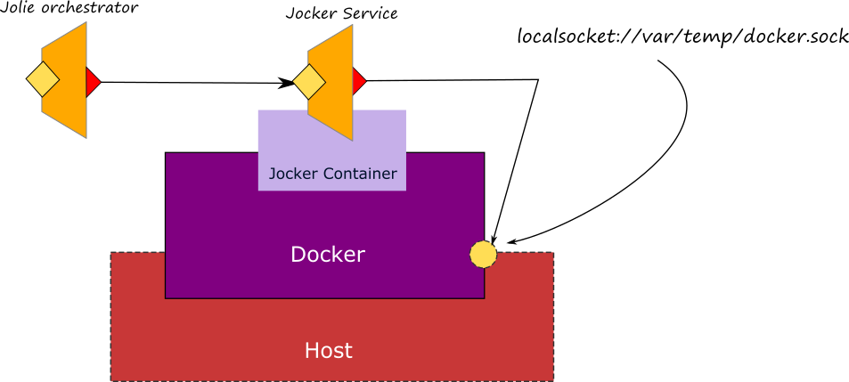

# Jocker

[Jocker](https://github.com/jolie/jocker) is a Jolie service which provides a Jolie interface of the [HTTP docker APIs](https://docs.docker.com/engine/api/v1.29/). Thanks to Jocker it is possible to interact with a docker server just as it is a Jolie service. At [this link](https://github.com/jolie/jocker/blob/master/InterfaceAPI.iol) it is possible to check the API supported by Jocker.

Jocker is available as a docker container, just type the following commands for activating a Jocker instance:

```text
docker pull jolielang/jocker
docker run -it -p 8008:8008 --name jocker -v /var/run:/var/run jolielang/jocker
```

**Important notes**

* Jocker is listening on the container internal port `8008`, thus if you need to change it, just configure properly the container when running it using the parameter `-p 8008:8008`.
* Jocker communicates with the docker server using the localsocket `/var/run/docker.sock` as it is suggested by docker documentation. Thus, pay attention when creating the jocker container to share the host volume where such a socket is available by setting parameter `-v /var/run:/var/run`.
* At the present Jocker is an experimental project, so use with cautions.



Once installed, it is possible to call Jocker as a usual Jolie service.

## Example: creating a Jolie orchestrator for deploying a Jolie system into docker

In this example we show how to build a Jolie orchestrator which is able to deploy a Jolie system by exploiting the Jocker APIs. The full code of the example can be checked [here](https://github.com/jolie/examples/tree/master/06_containers/05_jocker).

In this example we aim at deploying the same system commented at section [Basics/Composing Statements/Parallel](https://jolielang.gitbook.io/docs/basics/composing_statements#parallel) alltogether just executing a single orchestration jolie script. For the sake of brevity we grouped the three services into three different folders. At [this link](https://github.com/jolie/examples/tree/master/06_containers/05_jocker/services) it is possible to navigate the three folders. Each folder contains all th enecessary files for executing each single service, moreover it also contains the Dockerfile which defines how to deploy that specific service into docker as we exaplined in section [Containerization/Docker/Create an image](https://jolielang.gitbook.io/docs/containerization/docker#creating-a-docker-image).

The code of the orchestrator can be evaluated [here](https://github.com/jolie/examples/blob/master/06_containers/05_jocker/jockerOrchestrator.ol). Just try it running the following command:

```text
jolie jockerOrchestrator.ol
```

The steps it implements are:

**Creation of the system**

1. Creation of the docker images of the three services

   ```jolie
   build@Jocker(rqImg)(response);
   ```

2. Creation of the network `testnet` where connecting the containers 

   ```jolie
   createNetwork@Jocker( ntwCreate_rq )( ntwCreate_rs );
   ```

3. Creation of the three containers

   ```jolie
   createContainer@Jocker( cntCreate_rq )( cntCreate_rs );
   ```

4. Attaching each container to the network `testnet`

   ```jolie
   attachContainerToNetwork@Jocker( attachCnt2Ntw_rq )();
   ```

5. Starting of each container

   ```jolie
   startContainer@Jocker( startCnt_rq )();
   ```

6. Inspecting the container for checking it is running

   ```jolie
   inspectContainer@Jocker( inspect_rq )( inspect_rs );
   ```

**Testing the system**

1. Invoking of the `infoService` for testing if it is working

   ```jolie
   getInfo@InfoService( { .city = "Rome" } )( info )
   ```

**Disposing the system**

1. Stopping all the containers

   ```jolie
   stopContainer@Jocker( stopCnt_rq )();
   ```

2. Removing all containers

   ```jolie
   removeContainer@Jocker( stopCnt_rq )( );
   ```

3. Removing the network `testnet`

   ```jolie
   removeNetwork@Jocker( ntwRemove_rq )();
   ```

4. Removing all the images

   ```jolie
   removeImage@Jocker( rmImage_rq )();
   ```

