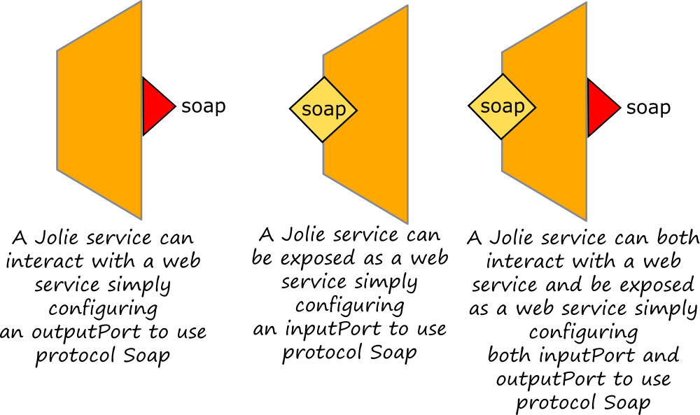

# Web Services

Web Services represent a special category of services. They are characterized by the usage of a set of specific XML based technologies like WSDL and SOAP. A Jolie service can both invoke existing web services and being exposed as a Web Service. It is very easy to do so, it is sufficient to parameterized a Jolie port \(input or output\) to use the protocol [soap](../protocols/soap.md) or the protocol soaps.



## Exposing a web service

In order to show how to expose a jolie service as a web service, let us consider the following Jolie service example which returns the address of a person identified by his name and his surname. The example may be consulted also at this [link](https://github.com/jolie/examples/tree/master/08_web_services/01_exposing_a_web_service)

```jolie
include "console.iol"
include "string_utils.iol"

execution{ concurrent }

type Name: void {
    .name: string
    .surname: string
}

type FaultType: void {
    .person: Name
}

type GetAddressRequest: void {
    .person: Name
}

type Address: void {
    .country: string
    .city: string
    .zip_code: string
    .street: string
    .number: string
}

type GetAddressResponse: void {
    .address: Address
}

interface MyServiceInterface {
RequestResponse:
    getAddress( GetAddressRequest )( GetAddressResponse ) 
        throws NameDoesNotExist( FaultType )
}

inputPort MyServiceSOAPPort {
    Location: "socket://localhost:8001"
    Protocol: soap 
    Interfaces: MyServiceInterface
}

main {
    getAddress( request )( response ) {
        if (  request.person.name == "Homer" &&
            request.person.surname == "Simpsons" ) {
            with( response.address ) {
                .country = "USA";
                .city = "Springfield";
                .zip_code = "01101";
                .street = "Evergreen Terrace";
                .number = "742"
            }
        } else {
            with( fault.person ) {
                .name = request.person.name;
                .surname = request.person.surname
            };
            throw( NameDoesNotExist, fault )
        }
    }
}
```

Once run, the service above is able to receive and send back SOAP messages but there is not any wsdl definition which can be shared with another web service client. The tool [jolie2wsdl](jolie2wsdl.md) can be used for automatically generating a wsdl file starting from a jolie service.

It is worth noting that once generated, the wsdl file must be explicitly attached to the jolie input port using protocol parameters `.wsdl` and `.wsdl.port` where the former specifies the path to the wsdl definition file and the latter defines the port into the wsdl definition to be mapped with the jolie one.

The final definition of the input port should look like the following one:

```jolie
inputPort MyServiceSOAPPort {
    Location: "socket://localhost:8001"
    Protocol: soap {
        .wsdl = "MyWsdl.wsdl";
        .wsdl.port = "MyServiceSOAPPortServicePort"
    }
    Interfaces: MyServiceInterface
}
```

where `MyWsdl.wsdl` is the file where the wsdl definition has been stored and `MyServiceSOAPPortServicePort` is the name of the port inside the wsdl definition to be joint with jolie input port `MyServiceSOAPPort`.

## Invoking a web service

A web service can be easily invoked as a standard jolie service by simply defining an output port with protocol soap. We just need to generate the corresponding jolie interface from the wsdl definition of the web service to be invoked and then use it within the caller.

As an example, let us extract the jolie interface from the wsdl definition of the example described in the section above using the tool [wsdl2jolie](https://jolielang.gitbook.io/docs/web-services/wsdl2jolie). The tool generates a `.iol` file which contains both the interface and the output port configured for interacting with the web service to be invoked. It is sufficient to import the file and invoking the web service as a standard jolie service. In the following example, where we suppose to name the generated file as `generated_interface.iol`, we show how to invoke the web service.

```jolie
include "generated_interface.iol"

main {
    with( request.person ) {
        .name = "Homer";
        .surname = "Simpsons"
    }
    getAddress@MyServiceSOAPPortServicePort( request )( response )
}
```

As it is possible to note, within a jolie service the the web service just appears as a simple output port called `MyServiceSOAPPortServicePort` and it can be invoked as a standard jolie service. The complete code of the example may be consulted at this [link](https://github.com/jolie/examples/tree/master/08_web_services/02_invoking_a_web_service)

