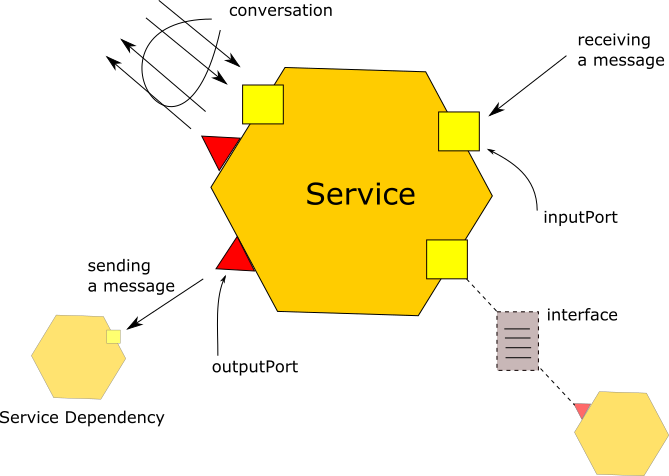

# The linguistic paradigm of (micro)services

This document defines the key elements of the linguistic paradigm of (micro)services.

This terminology is used in the Jolie website and documentation.

### Operation
A functionality exposed by a service.

### Interface
A machine-readable and -checkable declaration of a set of operations, which defines an API.
An interface acts as the contract between a service and its clients.

### Ports
Ports are endpoints used for sending and receiving messages.
There are two kind of ports:
- _input ports_ are used for receiving messages;
- and _output ports_ are used for sending messages.

A port includes at least three elements:
- the location at which the port is deployed, e.g., an IP address;
- the transport protocol used for communications through the port;
- the interface that the port makes accessible.

### Connection
We say that an output port is _connected to_ an input port when it is meant that messages sent through the former will reach the latter.

This typically happens when the output port has the same location and protocol as the target input port, but
network or container configurations might alter this. As such, knowing the connections in a system requires looking both at 
the definitions of the involved ports and how they are deployed in the system.

### Service (or microservice)
A service is a running software application that supplies APIs in the form of operations available at its input ports. It communicates with other services by message passing.

### Service definition
The code that, when executed, implements a service. When clear from the context, we simply use the word service interchangeably.

### Conversation
A conversation is a series of related message exchanges between two or more services.

During a conversation between a client and a service, the set of available operations offered by the service to the client might change over time (e.g., after successfully logging in the client might gain access to more operations).

A service is always willing to serve requests for its available API.

### Behaviour
The definition of some communication and/or computation logic to be executed at runtime for implementing a service's API.

### Process
A running instance of a behaviour, equipped with its own private state and message queues.

### Service dependency
When a service `A` has an output port that needs to be connected to another service `B` in order for the service `A` to function, we say that service `A` _depends on_ service `B`.

### Service network

A group of services and their connections.

Networks are always connected, in the sense that there is always a path from one service to another, possibly through many connections.

Networks might have _private locations_: locations that are visible only to the services in the network.

The nature of a private location depends on the implementation, e.g., shared-memory channels, local sockets, virtual networks.

Networks can be composed into bigger networks.

### Network boundary

Given a service network, we call its _boundary_ the set of:
- the input ports exposed by the services in the network that can be reached from outside of the network;
- the output ports that the services inside of the network require to be connected to services outside of the network.

### Cell

A group of service networks in execution.

### Cell boundary

The union of all the network boundaries of the cell.

### Cell overlay

A group of cells and the connections among the ports in their cell boundaries.
