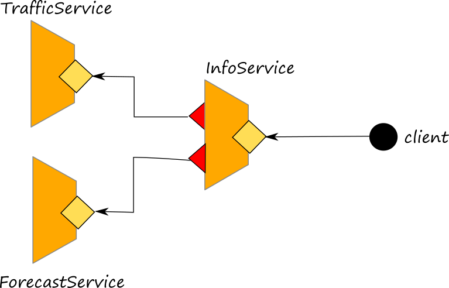

# Docker

[Docker](https://www.docker.com/) is a containerization technology. This section is devoted to show how deploy a Jolie microservice inside a Docker container. Basically, the only thing to do is to create a **Dockerfile** which allows for creating a Docker image that can be used for generating containers.

Before starting to show how to deploy a jolie microservice within a container docker, it is important to know that there is a Docker image which provides a container where Jolie is installed. Such an image can be found [at this link on dockerhub](https://hub.docker.com/r/jolielang/jolie). Such an image will be used in the following as base layer for deploying jolie services.

## Deploying a jolie service in a container Docker

Let us now consider an example of a very simple jolie service to be deployed into a docker container, the `helloservice.ol`:

```jolie
interface HelloInterface {

RequestResponse:
     hello( string )( string )
}

execution{ concurrent }


inputPort Hello {
Location: "socket://localhost:8000"
Protocol: sodep
Interfaces: HelloInterface
}

main {
  hello( request )( response ) {
        response = request
  }
}
```

The complete code of this example can be found [at this link](https://github.com/jolie/examples/tree/master/06_containers/01_deployment_with_docker).

## Creating a docker image

In order to create a docker image of this microservice, it is necessary to wrte down a Dockerfile. Thus, just open a text file in the same folder and name it **Dockerfile**. Then, edit it with ascript like the following one:

```dockerfile
FROM jolielang/jolie
MAINTAINER YOUR NAME <YOUR EMAIL> 
EXPOSE 8000
COPY helloservice.ol main.ol
CMD jolie main.ol
```

A complete list of all the available command for teh Dockerfile script can be found [at this link](https://docs.docker.com/engine/reference/builder/). Here we briefly describe the list of the commands above:

1. `FROM jolielang/jolie`: it loads the image `jolielang/jolie`;
2. `MAINTAINER YOUR NAME <YOUR EMAIL>`: it just specifies the name and email address of the file maintainer;
3. `EXPOSE 8000`: it exposes the port `8000` to be used by external invokers. Note that the service `helloservice.ol` is programmed to listen to the location `socket://localhost:8000`. This means that the jolie microservice always listens on this port **within** the container.
4. `COPY helloservice.ol main.ol`: it copied the file `helloservice.ol` within the image renaming it into `main.ol`. Note that in case a microservice requires more than one file to work, all the files must be copied into the image by respecting the folder structure of the project.
5. `CMD jolie main.ol`: this is the command to be executed by Docker when a container will be start from the image described by this Dockerfile.

Once the Dockerfile is ready, we need to run docker for actually creating the container image. Such a task can be achieved by typing the following command on the console:

```text
docker build -t hello .
```

where `docker build` is the docker command which builds a docker image starting from a Dockerfile and `hello` is the name of the image to be created. Once executed, it is possible to check if docker has created it by simply running the command which lists all the available images locally:

```text
docker images
```

## Running the docker container starting from the image

Once the image is created, the container is ready to be run. Just execute the following command for starting it:

```text
docker run -d --name hello-cnt -p 8000:8000 hello
```

where `-d` runs the container detached from the shell, `hello-cnt` is the name of the container and `-p 8000:8000` maps the internal port of the container to the hosting machine port. In this particular case the port is always `8000`. Finally, `hello` is the name of the image.

Once executed, the container is running and the jolie microservice can be easily invoked by a client. As an example wyou can try to invoke the service `helloservice.ol` using the follwing client:

```text
include "console.iol"

interface HelloInterface {
RequestResponse:
     hello( string )( string )
}

outputPort Hello {
Location: "socket://localhost:8000"
Protocol: sodep
Interfaces: HelloInterface
}


main {
  hello@Hello( "hello" )( response );
  println@Console( response )()
}
```

The container can be start and stop using the start and stop commands of docker:

```text
docker stop hello-cnt
docker start hello-cnt
```

## Passing parameters to the jolie microservices using environment variables

A microservice which is more complicated with respect to the service `helloservice.ol` discussed in the previous section, could require to be initialized with some parameters before being started. A possible solution to this issue is usually passing the parameters using the environment variables of the container. The command `run` of docker indeed, allows for specifying the environment variable of the container. As an example the command `run` presented in the previous section could be re-written as it follows:

```text
docker run -d --name hello-cnt -p 8000:8000 -e TESTVAR=spiderman hello
```

where we added the parameter `-e TESTVAR=spiderman` which initializes the environment variable `TESTVAR` with the value `spiderman`. Once executed, the container will be started with variable `TESTVAR` correctly initialized with the parameter value we want.

But how could we read it from a jolie service?

Reading an environment variable from a Jolie service is very simple. It is sufficient to exploit the standard library, in particular the [Runtime service](https://jolielang.gitbook.io/docs/standard-library-api/runtime). In this case we can use the operation `getEnv` which allows for reading the value of an environment variable and we could modify the previous example as it follows:

```jolie
include "runtime.iol"

interface HelloInterface {

RequestResponse:
     hello( string )( string )
}

execution{ concurrent }


inputPort Hello {
Location: "socket://localhost:8000"
Protocol: sodep
Interfaces: HelloInterface
}

init {
  getenv@Runtime( "TESTVAR" )( TESTVAR )
}

main {
  hello( request )( response ) {
        response = TESTVAR + ":" + request + ":" + args[0]
  }
}
```

The full code of this example can be consulted [here](https://github.com/jolie/examples/tree/master/06_containers/02_passing_parameters). Note that in the scope [init](https://jolielang.gitbook.io/docs/basics/processes#main-and-init) the service reads the environment variable `TESTVAR` and save it in the jolie variable with the same name `TESTVAR`. The variable `TESTVAR` is then used in the body of the operation `hello` for creating the response message. It is worth noting that at the beginning we need to include the `runtime.iol` service.

In order to try this example, just repeat the steps described at the previous section:

1. build the image with command `docker build -t hello .`. Note that the Dockerfile has not been modified. Remember to delete the previous container and image with commands: `docker rm hello-cnt` and `docker rmi hello`.
2. run the container specifying the environment variable as specified before: `docker run -d --name hello-cnt -p 8000:8000 -e TESTVAR=spiderman hello`
3. try to run the same client for checking how the response appears.

## Passing parameters by using a json configuration file

At this [link](https://github.com/jolie/examples/tree/master/06_containers/03_passing_configuration_file) we modified the previous example in order to show how it is possible to pass parameters through a json configuration file. In particular, we imagine to pass two parameters by using a file called `config.json` which is reported below:

```json
{
    "repeat":1,
    "welcome_message":"welcome!"
}
```

The service `helloservice.ol` has been modified for reading the parameters from this file in the scope `init` instead of reading from the environment variables. Here we report the code of the modified service:

```jolie
include "file.iol"

interface HelloInterface {

RequestResponse:
     hello( string )( string )
}

execution{ concurrent }


inputPort Hello {
Location: "socket://localhost:8000"
Protocol: sodep
Interfaces: HelloInterface
}

init {
  file.filename = "/var/temp/config.json";
  file.format = "json";
  readFile@File( file )( config )
}

main {
  hello( request )( response ) {
        /*  dummy usage of the parameters for building a response string which depends from them */
        response = config.welcome_message + "\n";
        for ( i = 0, i < config.repeat, i++ ) {
          response = response + request + " "
        }
  }
}
```

Note that here we exploit the standar API of [File](https://jolielang.gitbook.io/docs/standard-library-api/file). In particular, we exploit the operation `readFile@File` where we specify to read from file `/var/temp/config.json`. It is worth noting that in this case the path `/var/temp/` must be considered as an internal path of the container. Thus, when the service will be executed inside the container, it will try to read from its internal path `/var/temp/config.json`.

If we build the new image using the same Dockerfile as before, the service won't found the file `cofig.json` for sure because it is not contained inside the image. In order to solve such an issue we need to map the internal path `/var/temp` to a path of the host machine. The command `run` of docker allows to do such a map by using volume definition. Thus the run command will be like the following one:

```text
docker run -d --name hello-cnt -p 8000:8000 -v <Host Path>:/var/temp hello
```

The parameter `-v` allows for specifying the volume mapping. The `<Host Path>` token must be replaced with your local path where the file `config.json` is stored, whereas the path `/var/temp` specifies where mapping the volume inside the container.

## Configuring locations of outputPorts

Finally, let us point out the last issue you could encounter when deploying a jolie microservice within a docker container: the configuration of the outputPort locations. outputPorts often represent dependencies of the given microservice from other microservices. Dynamic binding can always be done from a programatic point of view as we it is described [here](https://jolielang.gitbook.io/docs/basics/dynamic_binding), but it could be useful to have a clean way for configuring these outputPorts at the startup of the service.

In order to show how to solve such an issue, we try to dockerize the example described in section [Parallel](https://jolielang.gitbook.io/docs/basics/composing_statements#parallel). In particular, in this example there is an orchestrator which collects information from two microservices: _TrafficService_ and _ForecastService_ as depicted in the picture below.



The full code of the example can be found [at this link](https://github.com/jolie/examples/tree/master/06_containers/04_configuring_outputports). Here we are in the case where an orchestrator \(`infoService.ol`\) has dependencies with other services: _ForecastService_ and _TrafficService_. Thus, we need to create three different containers, one for each service. In the example there are three different Dockerfiles for each service: [DockerfileForecastService](https://github.com/jolie/examples/blob/master/06_containers/04_configuring_outputports/DockerfileForecastService), [DockerfileTrafficService](https://github.com/jolie/examples/blob/master/06_containers/04_configuring_outputports/DockerfileTrafficService) and [DockerfileInfoService](https://github.com/jolie/examples/blob/master/06_containers/04_configuring_outputports/DockerfileInfoService).

The images can be created using the docker build command as explained in the previous sections:

* `docker build -t forecast_img -f DockerfileForecastService .`
* `docker build -t traffic_img -f DockerfileTrafficService .`
* `docker build -t info_img -f DockerfileInfoService .`

Before creating the related containers, we need to consider the architectural composition of the services and noting that the orchestrator requires the location of both the forecast service and the traffic one in order to invoke them. Indeed, if we inspect its definition [here](https://github.com/jolie/examples/blob/master/06_containers/04_configuring_outputports/infoService.ol) we can note that there are two outputPorts declared: `Forecast` and `Traffic`. Here the issue, is to pass the correct locations to the two outputPorts before knowing their actual location provided by Docker.

In order to solve such a puzzle, we exploit one of the feature of Docker that is the possibility to define a virtual network where all the services can be identified by an abstract name. Thus we create a network called `testnet`:

```text
docker create network testnet
```

All the containers we are going to create will have to be connected to network `testnet`. Here we report the three commands to execute for creating the containers starting from the previous docker images:

* `docker run -it -d --name forecast --network testnet forecast_img`
* `docker run -it -d --name traffic --network testnet traffic_img`
* `docker run -it -d --name info -p 8002:8000 -v <PATH TO config.ini>:/var/temp --network testnet info_img`

Note that the parameter `--network testnet` is used for connecting the container to the netwrok `testnet`. Thanks to this parameter the containers can be identified by using their name withint `testnet`.

Now, the last step: passing the correct locations to the outputPorts of the service `infoService`. Here we can exploit the extension [auto](https://jolielang.gitbook.io/docs/locations#automatic-configuration-of-a-location-using-extension-auto) which allows for automatic defining a location of a port getting the value from an external file. In particular, in the example, we use a `ini` file for achieving such a result:

```jolie
outputPort Forecast {
Location: "auto:ini:/Location/Forecast:file:/var/temp/config.ini"
Protocol: sodep
Interfaces: ForecastInterface
}

outputPort Traffic {
Location: "auto:ini:/Location/Traffic:file:/var/temp/config.ini"
Protocol: sodep
Interfaces: TrafficInterface
}
```

where the file `ini` is configured in this way:

```ini
[Location]
Traffic=socket://traffic:8000
Forecast=socket://forecast:8000
```

It is worth noting that here we use the name of the containers \(`traffic` and `forecast`\) for identifying them in the network. Docker will be responsible to resolve them within the context of `testnet`.

