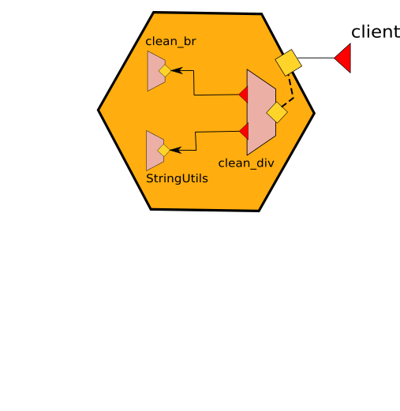

# Embedding

Embedding is a mechanism for launching a service from within another service. A service, called _embedder_, can _embed_ another service, called _embedded_ service, by targeting it with the `embed` primitive.

The syntax for embedding is:

```jolie
embed serviceName( passingValue ) [in existedPortName | as newPortName]
```

Above, we see that the `embed` statement takes as input a service name and an optional value.
Then, we can optionally bind an inputPort of the embedded service (which must be set as local) to an outputPort of the embedder.
To achieve that, we have two modalities:

- using the `in` keyword we bind the inputPort of the target to an _existing_ outputPort defined by the embedder;
- using the `as` keyword we create a new outputPort that has the same interface of the inputPort of the embedded service, besides being bound to it.

When that trailing part is missing, the embedded service runs without any automatic binding &mdash; however that does not mean it is not callable in other ways, e.g., through a fixed TCP/IP address like `"socket://localhost:8080"` or though a local location like `"local://A"`).

## Embedding the standard library

The Jolie standard library comes as a collection of services that users can `import` and use through the embedding mechanism. The usage of statement `import` is documented in section [Modules](./../../basics/modules/README.md)

The following example shows the usage of the `Console` service, which exposes operations for communication between Jolie and the standard input/output:

```jolie
from console import Console

service MyService {

    embed Console as C

    main {
        print@C( "Hello world!" )()
    }
}
```

The section of the documentation dedicated to the [standard library](../../standard-library-api/README.md) reports more information on the modules, types, and interfaces available to programmers with the standard Jolie installation.

## An example of embedding

Embedding Jolie services is very simple. In order to show how it works, let us consider a simple example whose executable code can be found [here](https://github.com/jolie/examples/tree/master/v1.10.x/04_architectural_composition/01_embedding_jolie/01_embedding).

In this example we want to implement a service which is able to clean a html string from the tags `<div>`, `</div>`, `<br>` and `</br>` replacing `br` with a line feed and a carriage return. In order to do this, we implement a parent service called _clean\_div.ol_ which is in charge to clean the div tags and another service called _clean\_br.ol_ in charge to clean the br tags. The service _clean\_div.ol_ embeds the service _clean\_br.ol_:

```jolie
from CleanBrInterface import CleanBrInterface
from CleanDivInterface import CleanDivInterface
from string_utils import StringUtils
from clean_br import CleanBr

service CleanDiv {

        execution: concurrent

        outputPort CleanBr {
            Interfaces: CleanBrInterface
        }

        embed StringUtils as StringUtils
        embed CleanBr in CleanBr

        inputPort CleanDiv {
            Location: "socket://localhost:9000"
            Protocol: sodep
            Interfaces: CleanDivInterface
        }

        main {
                cleanDiv( request )( response ) {
                        replaceAll@StringUtils( request { regex="<div>", replacement="" })( request )
                        replaceAll@StringUtils( request { regex="</div>", replacement="\n" })( request )
                        cleanBr@CleanBr( request )( response )
                }
        }
}
```



It is worth noting that:

- it is necessary to import the service _CleanBr_ from module _clean_br.ol_ and its interface from module _CleanBrInterface_
- the outputPorts _CleanBr_ and _StringUtils_ do not define nor the location and the protocol because they are set by the embedding primitive with location "local" and inner memory protocol.
- the embedding primitive joins the service _clean\_br.ol_ with the outputPort _CleanBr_ thus implying that each time we use port CleanBr inside the behaviour we will invoke the embedded service:

```jolie
cleanBr@CleanBr( request )( response )
```

- the _StringUtils_ is a service embedded from the standard library

## Hiding connections

Note that the embedding primitive, together with the usage of in-memory communication, allows for hiding connections among embedded microservices. In the example above the connection between the service _clean\_div.ol_ and _clean\_br.ol_ is hidden by the embedding and no external microservices can call the inputPort of the microservice _clean\_br.ol_.


## Cells (or multi services)

Here we introduce the concept of _cells_ as a unique execution context for a set of services. In a cell, one or more services can be executed within the same execution context. When there is only one service, the definition of a cell corresponds to the same of a service. A cell exhibits only the public available ports of the inner services. The ports that are not reachable by external invokers are considered internal ports and they are hidden from the point of view of a cell. Operationally, a cell can be obtained by exploiting the embedding primitive.


## Creating a script from a service architecture

Afterwards, we can write a modified version of the client program of the previous example, in order to directly embed the service _clean\_dv.ol_ thus **transforming the service architecture into a single script**. The code of this example can be found [here](https://github.com/jolie/examples/tree/master/v1.10.x/04_architectural_composition/01_embedding_jolie/02_script). Here we report the code of the script:

```jolie
from CleanDivInterface import CleanDivInterface
from console import Console
from clean_div import CleanDiv


service Script {

    outputPort CleanDiv {
        Interfaces: CleanDivInterface
    }

    embed CleanDiv in CleanDiv
    embed Console as Console


    main
    {
        div = "<div>This is an example of embedding<br>try to run the encoding_div.ol<br>and watch the result.</div>"
        println@Console("String to be cleaned:" + div )()
        cleanDiv@CleanDiv( div )( clean_string )
        println@Console()()
        println@Console( "String cleaned:" + clean_string )()
    }
}
```

It is worth noting that now the file _script.ol_ embeds the service _clean\_div.ol_ which embeds the service _clean\_br.ol_. Since _script.ol_ does not implement any inputPort but it just executes a script, when it reach the ends all the embedded services are automatically shut down.

## Dynamic Embedding

Dynamic embedding makes possible to associate a unique embedded instance to a single process of the embedder, thus allowing only that specific process to invoke the operations of the embedded service. Such a feature can be obtained by exploiting the API of the [runtime service](../../standard-library-api/runtime.md), in particular we will use operation _loadEmbeddedService_.

As an example let us consider the case of a calculator which offers the four arithmetic operators but it loads the implementation of them at runtime depending on the request selection. If the client specifies to perform a sum, the calculator will load the service which implements the sum and it will call it on the same operation _run_. The full code of the example can be found [here](https://github.com/jolie/examples/tree/master/v1.10.x/04_architectural_composition/05_dynamic_embedding/calculator), in the following we report the code of the calculator:

```jolie
from runtime import Runtime
from OperationInterface import OperationInterface
from CalculatorInterface import CalculatorInterface


service Calculator {
    execution: concurrent

    embed Runtime as Runtime

    /* common interface of the embedded services */
    outputPort Operation {
        interfaces: OperationInterface
    }

    inputPort Calculator {
        location: "socket://localhost:8000"
        protocol: sodep
        interfaces: CalculatorInterface
    }

    /* this is the body of each service which embeds the jolie service that corresponds to the name of the operation */
    define __embed_service {
            emb << {
                filepath = __op + ".ol"
                type = "Jolie"
            };
            /* this is the Runtime service operation for dynamic embed files */
            loadEmbeddedService@Runtime( emb )( Operation.location )

            /* once embedded we call the run operation */
            run@Operation( request )( response )
    }

    /* note that the embedded service is running once ofr each enabled session then it expires.
    Thus each call produce a new specific embedding for that call */
    main {
        [ sum( request )( response ) {
                __op = "sum";
                /* here we call the define __embed_service where the variable __p is the name of the operation */
                __embed_service
        }]

        [ mul( request )( response ) {
                __op = "mul";
                __embed_service
        }]

        [ div( request )( response ) {
                __op = "div";
                __embed_service
        }]

        [ sub( request )( response ) {
            __op = "sub";
            __embed_service
        }]
    }
}
```

The definition _embed\_service_ it is called within each operation offered by the calculator \(_sum_, _sub_, _mul_, _div_\) and it loads the specific service dynamically. Note that in this example the service files are named with the same name of the operations, thus there are the following files in the same folder of _calculator.ol_: _sum.ol_, _sub.ol_, _mul.ol_, _div.ol_. Each of them implement the same interface with different logics, thus they are polymorphic with respect the following interface:

```jolie
type RequestType {
    x: double
    y: double
}

interface OperationInterface {
    RequestResponse:
        run( RequestType )( double )
}

```

It is worth noting that the embedded service is running once for each enabled session then it expires. Thus each call produce a new specific embedding for that call.
