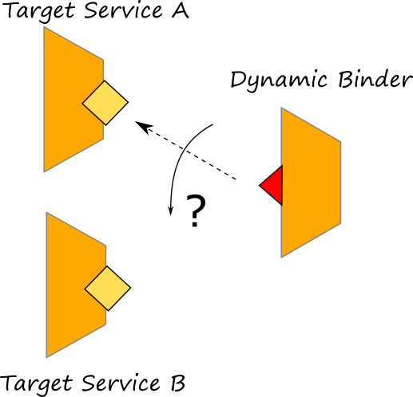

# Dynamic Binding

## Dynamic binding

Jolie allows output ports to be dynamically bound, i.e., their locations and protocols \(called _binding informations_\) can change at runtime. Such a feature is very important because it allows for the creation of dynamic systems where components \(microservices\) can be bound at runtime.



## Dynamic binding in Jolie

Changes to the binding information of an output port is local to a session: the configuration of the output ports are considered part of the local state of each session, indeed. Dynamic binding is obtained by treating output ports as variables. As an example, let us consider this [example](https://github.com/jolie/examples/tree/master/v1.10.x/02_basics/8_dynamicbinding/printers), where there is a printer-manager that is in charge to forward a message to print, to the right target service depending on the printer selection of the client. There are two printer services available: `printer1`  and `printer2`. Both of them share the same interface.


In particular the code of the printer-manager follows:

```jolie
from PrinterInterface import PrinterInterface
from PrinterManagerInterface import PrinterManagerInterface

service PrinterManager {

    execution: concurrent

    outputPort Printer {
        protocol: sodep
        interfaces: PrinterInterface
    }

    inputPort PrinterManager {
        location: "socket://localhost:8000"
        protocol: sodep
        interfaces: PrinterManagerInterface
    }

    main {
        print( request )( response ) {
            if ( request.printer == "printer1" ) {
                Printer.location = "socket://localhost:8001"
            } else if ( request.printer == "printer2" ) {
                Printer.location = "socket://localhost:8002"
            }
            printText@Printer( { text = request.text } )()
        }
    }
}
```

Here the dynamic binding is simply obtained by using a variable assignment.

```jolie
if ( request.printer == "printer1" ) {
    Printer.location = "socket://localhost:8001"
} else if ( request.printer == "printer2" ) {
    Printer.location = "socket://localhost:8002"
}
```

Note that the location of port `Printer` can be simply overwritten by referring to it using the path `Printer.location`.

## Example: programming a chat

We show a usage example of dynamic binding and binding transmission by implementing a simple chat scenario. It is composed by a `chat-registry` which is in charge to manage all the open chats and participants, and a `user` service which is in charge to manage a single participant connected to a chat. There are no limits to the users that can be connected to a chat. In the following diagram we report an example of the architecture where three users are connected to the service `chat-registry`.


The code can be consulted at this [link](https://github.com/jolie/examples/tree/master/v1.10.x/02_basics/8_dynamicbinding/chat).

The `chat-registry` and each `user` service exhibit an inputPort for receiving messages. The outputPort of the `chat-registry` which points to users is not bound to any service, but it needs to be bound dynamically depending on the users connected to a chat.

The `chat-registry` offers two operations: _addChat_ and _sendMessage_. The former operation permits to a user to connect to a chat, whereas the latter is exploited by the user to send messages to all the participants of a chat. The `user` service is composed by two services: service `User`, which is the main one, and service `UserListener` which is embedded by the former. Service `UserListener` is in charge to receive messages from the `chat-registry`  whereas the latter just manages the console for enabling human interactions and sending local messages to the `chat-registry`.

Dynamic binding is exploited in the implementation of the _sendMessage_ operation of the `chat-registry`  where every time a message is received the user's outputPort is bound to each registered user for forwarding messages. Note that user's locations are stored into the hashmap `global.chat.\(  \).users.\(  \).location` which is set every time a user requests to be connected to a chat by using operation _addChat_.

```jolie
[ sendMessage( request )( response ) {
    /* validate token */
    if ( !is_defined( global.tokens.( request.token ) ) ) {
        throw( TokenNotValid )
    }
}] {
    /* sending messages to all participants using dynamic binding */
    chat_name = global.tokens.( request.token ).chat_name
    foreach( u : global.chat.( chat_name ).users ) {
        /* output port dynamic rebinding */
        User.location = global.chat.( chat_name ).users.( u ).location
        /* message sending */
        if ( u != global.tokens.( request.token ).username ) {
            msg <<  {
            message = request.message
            chat_name = chat_name
            username = global.tokens.( request.token ).username
            }
            scope( sending_msg ) {
            install( IOException =>
                            target_token = global.chat.( chat_name ).users.( u ).token
                undef( global.tokens.( target_token ) )
                undef( global.chat.( chat_name ).users.( u ) )
                println@Console("User service not found, removed user " + u + " from chat " + chat_name )()
            )
            setMessage@User( msg )
            }
        }
    }
}
```

The operation _setMessage_ is exploited by the `chat-registry` to send a message to each participant of the chat. Note that such an operation is exhibited in the inputPort of the service `UserListener` at the user side.

## Compatibility of the interfaces

It is worth noting that, in case of dynamic binding, the interfaces defined in the output port must be compatible with those defined into the receiving input port. The following rules must be respected for stating that there is compatibility between two interfaces:

* all the operations defined in the interfaces at the output ports must be declared also in the interfaces at the input port \(it does not matter in which interface an operation is defined, it is important that it is defined\).
* all the types of the messages defined for the operations of the output port, must be compatible with the the correspondent type of the same operation at the receiving input port.
* a sending message type is considered compatible with the correspondent receiving one, when all the message it represents can be received without producing a _TypeMismatch_ on the receiver part.
