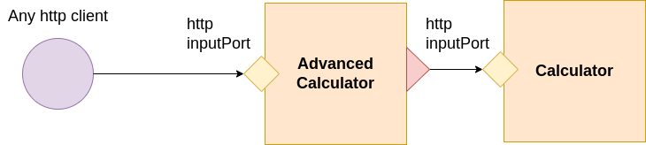
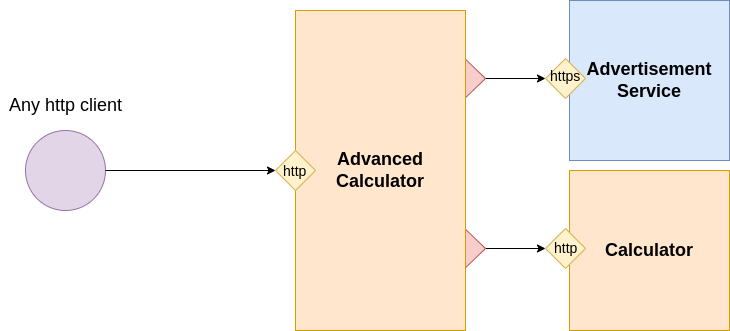

# The Calculator: using dependencies

In this tutorial you will learn to

1. [Creating a service on top of another one](#creating-a-service-on-top-of-another-one)
1. [Adding dependencies](#adding-dependencies)
1. [Using the dependencies in the behaviour](#unsing-the-dependencies-in-the-behaviour)
1. [Using more dependencies](#using-more-dependencies)
1. [Adding an outputPort with protocol https](#adding-an-outputport-with-protocol-https)
1. [Calling dependencies in sequence](#calling-dependencies-in-sequence)
1. [Calling dependencies in parallel](#calling-dependencies-in-parallel)

## The full code
The full code can be found [at this link](https://github.com/jolie/examples/tree/master/Tutorials/calculator/using_dependencies)


### Creating a service on top of another one

One of the key features of Jolie, is declaring the dependencies of a service by means of statement `outputPort`.  
An outputPort defines a target endpoint connected with a service and it allows to exchange messages with it.
In this tutorial we are going to show how to use dependencies.  We will develop a new service which offers some advanced arithmetic operations,
that uses the four basic arithmetical operations supplied by the `CalculatorService` described in the tutorial _Getting Started_.
Before illustrating the code, let us depict what we are going to build in the following picture:



The `AdvancedCalculatorService` will be a new service available for a client together with the `CalculatorService`. The `AdvancedCalculatorService` will exploit the operations offered by the `CalculatorService` in order to supply its own operations.

#### the interface of the AdvancedCalculatorService

In the following we report the interface of the `AdvancedCalculatorService`:

```jolie
type FactorialRequest: void {
    term: int
}
type FactorialResponse: void {
    factorial: long 
}

type AverageRequest: void {
    term*: int 
}
type AverageResponse: void {
    average: double
}

type PercentageRequest: void {
    term: double
    percentage: double
}
type PercentageResponse: double

interface AdvancedCalculatorInterface {
    RequestResponse:
        factorial( FactorialRequest )( FactorialResponse ),
        average( AverageRequest )( AverageResponse ),
        percentage( PercentageRequest )( PercentageResponse )
}
```

The service offers three operations: `factorial`, `average` and `percentage` whose meaning is quite intuitive.

## Adding dependencies

In the following we report the actual definition of the `AdvancedCalculatorService`:

```jolie
from .AdvancedCalculatorServiceInterfaceModule import AdvancedCalculatorInterface
from .CalculatorInterfaceModule import CalculatorInterface

service AdvancedCalculatorService {

    execution: concurrent

    outputPort Calculator {
        location: "socket://localhost:8000"
        protocol: http { format = "json" }
        interfaces: CalculatorInterface
    }

    inputPort AdvancedCalculatorPort {
        location: "socket://localhost:8001"
        protocol: http { format = "json" }
        interfaces: AdvancedCalculatorInterface
    }

    ...
}
```

It is worth noting that in the first lines we import both the interfaces of the `AdvancedCalculatorService` and the `CalculatorService`. We will use the former one for defining the inputPort of the `AdvancedCalculatorService`, whereas we will use the latter one for defining the outputPort towards the `CalculatorService`. Both the declarations can be found before the definition of scope `main`.

Note that the `location` of an outputPort defines the target location of the service to be invoked; the protocol must correspond to that defined into the corresponding inputPort; and, finally, the interface is used to declare all the available operations that can be used with that dependency. It is not mandatory that the interface defined into an outputPort must be the same of that defined in the corresponding inputPort, but it is important that all the operations in that of the outputPort are defined into the target inputPort too.

### Unsing the dependencies in the behaviour

```jolie
main {
    [ factorial( request )( response ) {
        for( i = request.term, i > 0, i-- ) {
            req_mul.factor[ #req_mul.factor ] = i
        }
        mul@Calculator( req_mul )( response.factorial )      
    }]

    [ average( request )( response ) {
        sum@Calculator( request )( sum_res )
        div@Calculator( { dividend = double( sum_res ), divisor = double( #request.term ) })( response.average )
    }]

    [ percentage( request )( response ) {
        div@Calculator( { dividend = request.term, divisor = 100.0 })( div_res )
        mul@Calculator( { factor[0] = div_res, factor[1] = request.percentage })( response )
    }]
}
```

The behaviour contains the code of the three operations where each of them exploits at least one operation of the `CalculatorService`. Operation `factorial` uses `mul@Calculator`, operation `average` uses `sum@Calculator` and `div@Calculator`, finally operation `percentage` uses `div@Calculator` and `mul@Calculator`.

The primitive we use for invoking a _RequestResponse_ (in this case a RequestResponse of the `CalculatorService`) is called _SolicitResponse_. It is a synchronous primitive which sends a message and waits for its response before continuing. Its syntax is quite simple: it requires the name of the operation to be invoked, followed by `@` and the name of the outputPort operation which defines the dependency (in this case the name of the outputPort is `Calculator`). Let us discuss here, what happens in operation `average`: the first thing is to make the sum of all the received terms. Luckily, the type of the request message of operation `average` is equal to that of operation `sum` at the `CalculatorService`, thus we can just send the same message (`sum@Calculator( request )( sum_res )`). Then, we just divide the summation by the number of received terms. We use the operation `div` for achieving such a result.

**Tips:** character `#`, when used before a variable path, plays the role of operator _size_ and it returns the number of the elements of the related vector. In the example, we read the statement `#request.term` as _the number of elements of vector term within the node request_.

##### Running the example

In order to run the example, we need to launch both `CalculatorService` and `AdvancedCalculatorService`. Thus, we need to open two shells and run the following commands, one for each shell:

1. `jolie CalculatorService.ol`
2. `jolie AdvancedCalculatorService.ol`

In a third shell, try to run the following clients:

- `curl 'http://localhost:8001/factorial?term=5'`
- `curl 'http://localhost:8001/average?term=1&term=2&term=3'`
- `curl 'http://localhost:8001/percentage?term=50&percentage=10'`


using more than one dependency

In this tutorial we specialize the system of services presented in tutorial [Using Dependencies](../using-dependencies/README.md).
In particular, here we suppose to add an advertise message to each call of the `AdvancedCalculatorService`. The message is retrieved by invoking an external service not implemented in Jolie but exposed using REST.


In the architecture, the `AdvancedCalculatorService` has one dependency more, from which it can get the advertise messages.
In order to simulate the advertise message provider, here we exploit a funny service which returns [Chuck Norris jokes](https://api.chucknorris.io/).

### Using more dependencies

Now we intend to add an external service deployed on the Internet for providing fake advertisements in the responses.



#### The full code

The fullc ode can be found [at this link](https://github.com/jolie/examples/tree/master/Tutorials/calculator/using_more_than_one_dependency)

#### The new interface of the AdvancedCalculatorService

In the following, we report the new interface of the `AdvancedCalculatorService` that we modified in order to deal with the advertise messages.

```jolie
type FactorialRequest: void {
    term: int
}
type FactorialResponse: void {
    factorial: long 
    advertisement: string
}

type AverageRequest: void {
    term*: int 
}
type AverageResponse: void {
    average: double
    advertisement: string
}

type PercentageRequest: void {
    term: double
    percentage: double
}
type PercentageResponse: double {
    advertisement: string 
}

interface AdvancedCalculatorInterface {
    RequestResponse:
        factorial( FactorialRequest )( FactorialResponse ),
        average( AverageRequest )( AverageResponse ),
        percentage( PercentageRequest )( PercentageResponse )
}

```

It is worth noting that all the response messages, now contain a new field called `advertisement` that is a string. Thus we expect to receive a new advertise message for each operation call.

### Adding an outputPort with protocol https

IThe definition of the `AdvancedCalculatorService` is enriched adding the output port `Chuck` which points to a free external service in the Internet, which just replies with fake sentences about Chuck Norris.

```jolie
from .AdvancedCalculatorServiceInterfaceModule import AdvancedCalculatorInterface
from .CalculatorInterfaceModule import CalculatorInterface

interface ChuckNorrisIface {
    RequestResponse: random( undefined )( undefined )
}

service AdvancedCalculatorService {

    execution: concurrent

    outputPort Calculator {
        location: "socket://localhost:8000"
        protocol: http { format = "json" }
        interfaces: CalculatorInterface
    }
    
    outputPort Chuck {
        location: "socket://api.chucknorris.io:443/"
        protocol: https {
            .osc.random.method = "get";
            .osc.random.alias = "jokes/random"
        }
        interfaces: ChuckNorrisIface
    }

    inputPort AdvancedCalculatorPort {
        location: "socket://localhost:8001"
        protocol: http { format = "json" }
        interfaces: AdvancedCalculatorInterface
    }

    ...
```

Note that:
<!-- cSpell:ignore chucknorris -->
- there are two outputPorts definitions. The former one points to the `CalculatorService` as we described in the tutorial _Getting Started_, whereas the latter one points to the service `chucknorris.io` we use for simulating the advertisement service;
- the outputPort `Chuck` uses protocol `https`. The location is `socket://api.chucknorris.io:443/`  where the port is the https standard one:`443`;
- the outputPort `Chuck` declares an interacted with only one operation: `random`. No types are defined.
- the HTTPS protocol has two parameters: `osc.random.method` and `osc.random.alias`. The former one specifies to use HTTP method GET when operation `random` is invoked; the latter one specifies how to build the url when operation `random` is invoked. In particular, when operation `random` is invoked, the final URL is obtained as the concatenation of the location  with the specified alias(`api.chucknorris.io:443/jokes/random`). _alias_ has been introduced in protocols `http` and `https` for mapping service operations with the actual target urls;


### Calling dependencies in sequence

```jolie
main {
        [ factorial( request )( response ) {
            for( i = request.term, i > 0, i-- ) {
                req_mul.factor[ #req_mul.factor ] = i
            }
            mul@Calculator( req_mul )( response.factorial )  
            random@Chuck()( chuck_res )
            response.advertisement = chuck_res.value          
        }]

        ...
    
```

In the behaviour of operation `factorial` the operation `random@Chuck` is executed after `mul@Calculator`, this means that the request message to `random@Chuck` is sent only after receiving the response from `mul@Calculator`

### Calling dependencies in parallel

 ```jolie
 ...
 [ average( request )( response ) {
    {
        sum@Calculator( request )( sum_res )
        div@Calculator( { dividend = double( sum_res ), divisor = double( #request.term ) })( response.average )
    }
    |
    {
        random@Chuck()( chuck_res )
        response.advertisement = chuck_res.value
    }
}]

[ percentage( request )( response ) {
    {
        div@Calculator( { dividend = request.term, divisor = 100.0 })( div_res )
        mul@Calculator( { factor[0] = div_res, factor[1] = request.percentage })( response_mul )
        response = response_mul
    }
    |
    {
        random@Chuck()( chuck_res )
        response.advertisement = chuck_res.value
    }
}]
...
```
- in the behaviors of operations `average` and `percentage`, `random@Chuck` is executed in parallel with those directed to service `Calculator`. Parallelism is expressed using operator `|`. A parallel composition is finished when all the parallel branches are finished. In operation `factorial` parallelism can be used too,  sequential composition has been used just for illustrating a different way for composing statements;
- in the behaviour of operation `average`, the response message can be concurrently prepared in the two parallel branches because the assignments involve two different subnodes of variable `response`: `response.average` and `response.advertisement`. The parallel assignments on two separate subnodes of the same variable does not trigger any conflict;
- in the behaviour of operation `percentage`, variable `response` is not directly assigned in the response message of `mul@Calculator` ( as it happen writing `mul@Calculator( { factor[0] = div_res, factor[1] = request.percentage })( response )`). It is because a solicit-response always erases the variable used for storing the received reply. So, if the response to `mul@Calculator` was received after the execution of `response.advertisement = chuck_res.value` in the parallel branch, the content of node `advertisement` would be erased.  Using placeholder `response_mul` and then making the assignment `response = response_mul` allows us to just valorize the root value of variable `response` preserving the contents of the subnodes.


#### Running the example

In order to run the example, we need to launch both `CalculatorService` and `AdvancedCalculatorService`. Thus, we need to open two shells and run the following commands, one for each shell:

1. `jolie CalculatorService.ol`
2. `jolie AdvancedCalculatorService.ol`

In a third shell, try to run the following clients:

- `curl 'http://localhost:8001/factorial?term=5'`
- `curl 'http://localhost:8001/average?term=1&term=2&term=3'`
- `curl 'http://localhost:8001/percentage?term=50&percentage=10'`


