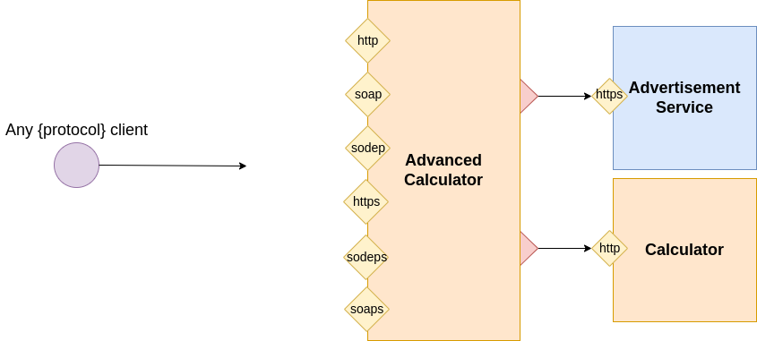

# The Calculator: using more input ports and protocols

In this tutorial we will show how to add more input ports in a service. In such a way, it is possible to enable the service to receive messages with different formats and protocols by exploiting the same behaviour.
In particular, we modify the service `AdvancedCalculatorService` of the tutorial [Using more than one dependency](../using-more-than-one-dependency/README.md) as depicted in the following diagram:

Besides the existing port for protocol `http`, Input ports will be incrementally added for the following protocols:

- [soap](./soap/README.md)
- [sodep](./sodep/README.md)
- [https](./https/README.md)
- [soaps](./soaps/README.md)
- [sodeps](./sodeps/README.md)

All the examples may be consulted at this [link](https://github.com/jolie/examples/tree/master/v1.10.x/tutorials/more_inputports_and_protocols)
