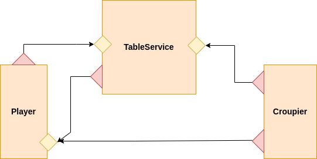
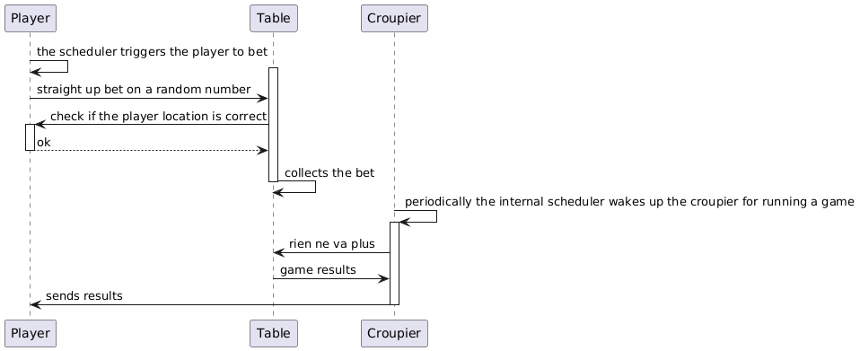
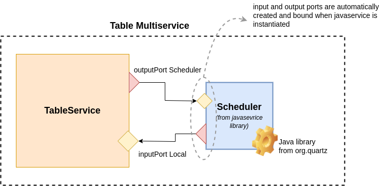

# Roulette Tutorial

_credits_: __Adelmo Gentilini__

In this tutorial we will cover the following arguments:

1. [Defining different input ports for different participants](#defining-different-input-ports-for-different-participants)
1. [Programming an internal scheduler for waking up a service and executing some tasks](#programming-an-internal-scheduler-for-waking-up-a-service-and-executing-some-tasks)
1. [Using a global variable for storing data at the level of the service](#using-a-global-variable-for-storing-data-at-the-level-of-the-service)
1. [Programming dynamic binding](#programming-dynamic-binding)
1. [Using synchronized statement for programming a mutual exclusion access to different parts of code](#using-synchronized-statement-for-programming-a-mutual-exclusion-access-to-different-parts-of-code)
1. [Using Math library for generating a random number](#using-math-library-for-generating-a-random-number)
1. [Using default for catching all the  faults in a scope](#using-default-for-catching-all-the-faults-in-a-scope)
1. [Using foreach for ranging over the subnodes of a variable](#using-foreach-for-ranging-over-the-subnodes-of-a-variable)
1. [Using valueToPrettyString of StringUtils library for printing out the content of a tree](#using-valuetoprettystring-of-stringutils-library-for-printing-out-the-content-of-a-tree)

## Overview
The system is composed by three different services: _TableService_, _Croupier_, _Player_ where the last one could be run in more than on instances.



The player can bet on numbers on a roulette of the TableService. Bets are collected until the croupier runs the roulette hosted in the TableService. Then the croupier collects the results for the TableService and sends the notification to the players for both winner bets and lost bets.

Run the system using the following commands in different shells:

```jolie
jolie --params player-params.json Player.ol

jolie --params croupier-params.json Croupier.ol

jolie --params table-params Table.ol

```


### The full code
The full code of the tutorial can be downloaded [here](https://github.com/jolie/examples/tree/master/Tutorials/roulette/simple-version)

## Learning

### Defining different input ports for different participants

The TableService offers two different input ports for interacting with players and the croupier:

```jolie
    interface TableToPlayerInterface {
        RequestResponse:
            straightUpBet( StraightUpBetRequest )( string ) throws LocatioNotValid
    }

    interface TableToCroupierInterface {
        RequestResponse:
            rienNeVaPlus( void )( RienNeVaPlusResponse )
    }

    inputPort PlayerPort {
        location: p.locations.playerPort
        protocol: sodep
        interfaces: TableToPlayerInterface
    }

    inputPort CroupierPort {
        location: p.locations.croupierPort
        protocol: sodep
        interfaces: TableToCroupierInterface
    }

```
where `p` is a tree parameter passed to the service when initialized. 

In this way, players and cropiers can interact with the same session of the _TableService_ using separated endpoints where different APIs are exposed.

The croupier does not exhibit any input port, but it just interact as a client both towards the _TableService_ and the players.

Finally, a Player exhibits an endpoint for receiving check and final results both from _TableService_ and _Croupier_

#### Runtime View


For the sake of this example, the _TableService_ always accepts bets from the players, except when operation _rienNeVaPlus_ is called from the _Croupier_. 

### Programming an internal scheduler for waking up a service and executing some tasks
A scheduler can be very helpful for programming a cronjob that triggers an activity at the level of the service. In this example both the _Player_ and _Croupier_ uses it.

In the following we discuss the case of the _Croupier_. first of all, let us consider the architecture:



The _TableService_ acts also as an embedder instantiating Console and Scheduler services from the standard library. 

```jolie

from scheduler import Scheduler    
from console import Console
...
embed Console as Console
embed Scheduler as Scheduler
```
Actually, both of them are services and the interaction must always follow a message passing approach. The scheduler is set sending messages on its inputPort and it sends a callback message when a job is scheduled to run.

It is worth noting that the outputPort Scheduler within the _TableService_ is automatically created by the statement `embed Scheduler as Scheduler` whereas the inputPort of the Scheduler is declared in its [service definiton](https://github.com/jolie/jolie/blob/master/packages/scheduler.ol) which can be found in the package folder of the standard library.

The [Scheduler javaservice](https://github.com/jolie/jolie/tree/master/javaServices/coreJavaServices/src/main/java/joliex/scheduler) uses open source java libraries form _org.quartz_ for implementing its behaviour.

In the following we report the piece of code of the _Croupier_ which implements the interaction with the _Scheduler_

```jolie
init {
    setCallbackOperation@Scheduler( { operationName = "wakeUp" })  
    // setting cronjob
    setCronJob@Scheduler( {
        jobName = "bet"
        groupName = "roulette"
        cronSpecs << {
                second = "0"
                minute = "0/1"
                hour = "*"
                dayOfMonth = "*"
                month = "*"
                dayOfWeek = "?"
                year = "*"
        }
    })()
    enableTimestamp@Console( true )()
}

main {

    [ wakeUp() ] {
        rienNeVaPlus@Table()( response )
        for( w in response.winners ) {
            Player.location = w.location_player
            undef( payout_req )
            payout_req << {
                payout = w.payout
                number = w.number
            }
            payout@Player( payout_req )
        }
        for( l in response.loosers ) {
            Player.location = l.location_player
            undef( lost_req )
            lost_req << {
                lost = l.lost
                number = l.number
                winnerNumber = response.winningNumber
            }
            lost@Player( lost_req )
        }
    }
}
```
In the scope `init` we set the cron jobs using the operation `setCronJob` of the library `scheduler`. Note that we previously set the OneWay operation where it will receive the notification fron the scheduler, it is named `wakeUp`.
```jolie
setCallbackOperation@Scheduler( { operationName = "wakeUp" })
```

Such an operation, has been declared in the local input port `Local`is automatically bound to the javaservice outputPort of the scheduler library. A javaservice indeed always send its messages to the location `local` of the parent. At this [line](https://github.com/jolie/jolie/blob/845c01753d8d0222902215eedf044277d29cfce3/javaServices/coreJavaServices/src/main/java/joliex/scheduler/SchedulerServiceJob.java#L51) of the scheduler javaservice it is possible to check the code for sending a message to the parent.

```jolie
interface LocalInterface {
    OneWay:
        wakeUp( undefined )
}

inputPort Local {
    location: "local"
    interfaces: LocalInterface
}
```
### Using a global variable for storing data at the level of the service
Global variables can be used for persisting data at the level of service instead of sessions. Global variables can be accessed and written fron any sessions and they are deleted only when the service is shut down, . 

As na example, in _TableService_ we use global variables for persisting bets from players.

```jolie
global.db.bets.( request.player )[ #global.db.bets.( request.player ) ] << request
```


### Programming dynamic binding
Dynamic binding is used when the _Player_ sends its location to the _TableService_ during a bet invocation. 

```jolie
bet_req << {
    player = global.player
    amount = amount
    number = number
    player_location = global.location 
}
```
In the _Player__ the location is simply stored within the global variable `global.location` and it is a string.


This location is then used by the _TableService_ for checking if it is able to receive or not by invoking the operation `check` declared into the interface ` PlayerGameInterface`.
```jolie
PlayerPort.location = request.player_location
check@PlayerPort()()
```
It is sufficient to assign the location to the node `location` of the outputPort `Player` within the _TableService_. Note that the outputPort `Player` has beed defined without any location because it is always bound at runtime.

```jolie
outputPort PlayerPort {
    protocol: sodep
    interfaces: PlayerGameInterface
}
```
The outputPort locations are treated as session variables, thus any executing session of the service may have different locations. When a session is finished the location of the outputPort si cancelled.


### Using synchronized statement for programming a mutual exclusion access to different parts of code
`synchrnoized` is used for guaranteeing mutual exclusion among different parts of a service behaviour. In particular, in _TableService_ is used withinn the imoplementation of operations `rienNeVaPlus` and `straithUpBet`
```jolie
...

// straightUpBet
synchronized( spinning ) {
    global.db.bets.( request.player )[ #global.db.bets.( request.player ) ] << request
}

...

// rienNeVaPlus
synchronized( spinning ) {
    global.db.spin[ #global.db.spin ] = winningNumber
    foreach ( gioc : global.db.bets ) {
        for ( bet in global.db.bets.( gioc ) ) {
            if ( winningNumber == bet.number ){
                response.winners[ #response.winners ] << {
                    location_player = bet.player_location
                    payout = bet.amount * 37
                    number = bet.number
                }
            } else {
                response.loosers[ #response.loosers ] << {
                    location_player = bet.player_location
                    lost = bet.amount
                    number = bet.number
                }
            }
        }
    }
    undef( global.db.bets )
}

...
```
syncrhonized is also used within the _Player_ for reading and writing the `wallet`.

### Using Math library for generating a random number
It is very easy to generate a random number using the library _Math_. Both the _Player_ and the _TableService_ exploits it. In the following we report the example in the operation `rienNeVaPlus` of the _TableService_.

```jolie
random@Math()( temp )
winningNumber = response.winningNumber = int( temp * 37 )
```

### Using default for catching all the  faults in a scope
In some cases, it could be useful to catch all the faults in a scope and rethorwing a defined fault. Such an approach has been used in the _TableService_ when processing a bet from the _Player_:

```jolie
scope( check_player ) {
    install( default => throw( LocatioNotValid))
    PlayerPort.location = request.player_location
    check@PlayerPort()()
    ...
}
```
the keyword `default` means that all the faults are captured by the install and a fault `LocationNotValid` is rethrown. Note that the fault `LocationNotValid` has been declare also in the interface:
```jolie
interface TableToPlayerInterface {
    RequestResponse:
        straightUpBet( StraightUpBetRequest )( string ) throws LocatioNotValid
}
```

### Using foreach for ranging over the subnodes of a variable
foreach is a powerful statement for ranging over all the subnodes of a tree node. In _TableService_ is used for ranging over all the btes collected from each player:

```jolie
foreach ( gioc : global.db.bets ) {
    for ( bet in global.db.bets.( gioc ) ) {
        if ( winningNumber == bet.number ){
            response.winners[ #response.winners ] << {
                location_player = bet.player_location
                payout = bet.amount * 37
                number = bet.number
            }
        } else {
            response.loosers[ #response.loosers ] << {
                location_player = bet.player_location
                lost = bet.amount
                number = bet.number
            }
        }
    }
}
```
Bets are collected within a map denoted by the player name. For each player, the bets are stored as vectors.

### Using valueToPrettyString of StringUtils library for printing out the content of a tree
`valueToPrettyString` is a useful functionality ecposed by the StringUtils library which allows, together with the `println` of the Console service, to print out all the tree contained in a variable. In this example, is used by the _TableService_ for printing out the results after a game:

```jolie
 println@Console("Report after last run:")()
valueToPrettyString@StringUtils( response )( s )
println@Console( s )()
```

# Conclusion
In this tutorial we discussed a simple system formed by three services _TableService_, _Player_ and _Croupier_ which simulates a simple roulette where player can bet on numbers.