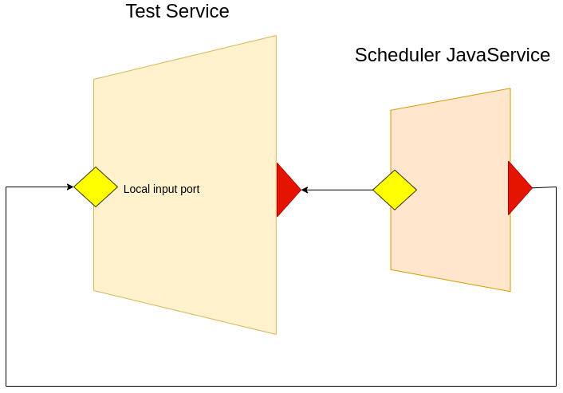

# Using cron scheduler

In this section we provide an example on how to use the scheduler library for setting cron jobs in Jolie.
Before showing the example, leu us show the target architecture.



The test service embeds `Scheduler` imported from package `scheduler`.
THe Scheduler Service can be programmed by setting the OneWay operation wbere receiving the alarms when they are triggered by the jobs. The jobs can be added and deleted easily, by using the API offered by the Scheduler Service.

In the following example we report the code. Juts run it with the following command:
```
jolie test.ol
```

A job which runs every minute will trigegr the alarm, and a message with the job name and the group name will be printed out.

```jolie
from scheduler import Scheduler     // imported the Scheduler
from console import Console

type SchedulerCallBackRequest: void {
    .jobName: string
    .groupName: string
}

interface SchedulerCallBackInterface {
OneWay:
  schedulerCallback( SchedulerCallBackRequest )     // definition of the call-back operation
}

service Test {

    execution: concurrent

    embed Scheduler as Scheduler    // embedding the scheduler service
    embed Console as Console


    // internal input port for receiving alarms from Scheduler
    inputPort MySelf {
        location: "local"
        interfaces: SchedulerCallBackInterface
    }

    init {
        // setting the name of the callback operation
        setCallbackOperation@Scheduler( { operationName = "schedulerCallback" })  
        // setting cronjob
        setCronJob@Scheduler( {
            jobName = "myjobname"
            groupName = "myGroupName"
            cronSpecs << {
                    second = "0"
                    minute = "0/1"
                    hour = "*"
                    dayOfMonth = "1/1"
                    month = "*"
                    dayOfWeek = "?"
                    year = "*"
            }
        })()
        enableTimestamp@Console( true )()
    }

    main {
        [ schedulerCallback( request ) ] {
            println@Console( request.jobName + "/" + request.groupName )()
        }
    }
}
```