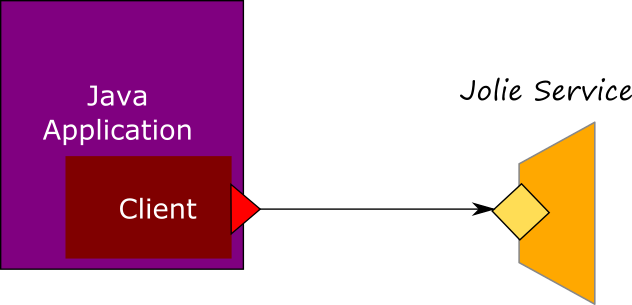

# Java Client
The creation of a Java Client allows for an easy integration with an existing Jolie service from a Java application by simply using the sodep protocol. In this case you don't need to introduce a rest interface over a http protocol, or a SOAP communication layer, you can just explott the easiest way offered by Jolie for building a service: the protocol [SODEP](../../protocols/sodep.md).

In the following picture we briefly represent how the final architecture of the Jolie Client appears.

