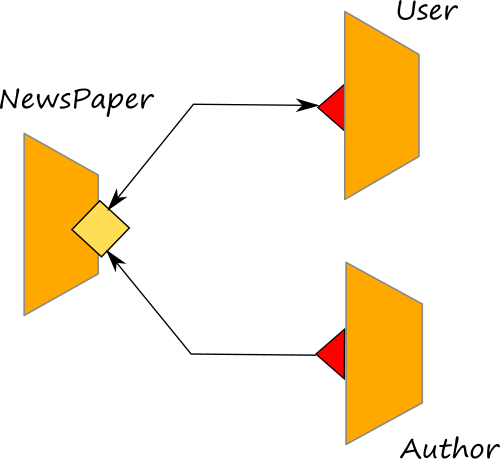

# Communication Primitives

Communication primitives are strictly related to the operations declared in the interfaces and the ports defined into the service. Communication primitives can be divided in two categories:

* input primitives
* output primitives

Input primitives are triggered by a message reception, whereas the output primtives enable a message sending.

## Input primitives

Input primitives can be divided in two types which also correspond to those used into the interface declaration:

* **one-way**: a message can be received from an external caller. It must correspond to a OneWay operation declared into an interface.
* **request-response**: a message can be received from an external caller, and a synchronous reply can be sent back. It must correspond to a RequestResponse operation declared into an interface.

In order to program a one-way operation inside the behaviour of a service, it is sufficient to declare the name of the OneWay operation published into an inputPort of the service followed by the name of the variable between brackets where the received message will be stored.

```jolie
operation_name( request )
```

On the other hand, a request-response operation requires the name of a RequestResponse operation defined into an interface followed by two variables: the former is in charge to store the receiving message whereas the latter is in charge to store the replying message. Both the variables must be defined within brackets. Since a request-response primitive is a synchronous primitive, between the request and the response message some code can be executed. The caller will wait for the termination of that code before receiving for the reply.

```jolie
operation_name( request )( response ){
    // code block
}
```

As an example let us consider the following service which has two operations defined. The former is a one-way operation and the latter a request-response one.

```jolie
from console import Console

interface MyInterface {
OneWay:
    myOW( string )
RequestResponse: 
    myRR( string )( string ) 
}

service MyService {
    execution: concurrent

    embed Console as Console

    inputPort myPort {
        location: "socket://localhost:8000"
        protocol: sodep
        interfaces: MyInterface
    }

    main {
        [ myOW( request ) ]{ println@Console("OW:" + request )() }

        [ myRR( request )( response ) {
            println@Console("RR:" + request )();
            response = "received " + request
        }]
    }
}
```

## Output primitives

Output primitives allow for sending messages to some input operations defined on another service. Also the output primitives can be divided into two categories:

* **notification**: a message can be sent to a receving one-way operation.
* **solicit-response**: a message can be sent to a receiving request-response operation. The solicit-response is blocked until the reply message is received.

The syntax of notification and solicit-response resembles those of one-way and request-response with the exception that the operation name is followed by the token `@` and the name of the outputPort to be used for sending the message. Here in the following, we report the syntax of the notification where _OutputPort\_Name_ is the name of the outputPort to be used and _request_ is the variable where the sending message is stored.

```jolie
operation_name@OutputPort_Name( request )
```

Analogously, in order to program a solicit-response it is necessary to indicate the port used to send the message. Differently from the one-way primitive, in the solicit-response one the first variable contains the message to be sent and the second one contains the variable where the reply message will be stored. No code block is associated with a solicit-response primitive because it simply sends a message and waits until it receives a response from the requested service.

```jolie
operation_name@OutputPort_Name( request )( response )
```

In the following we report a possible client of the service above which is able to call the operations _myOW_ and _myRR_ in sequence:

```jolie
from console import Console

execution: concurrent

interface MyInterface {
OneWay:
    myOW( string )
RequestResponse: 
    myRR( string )( string ) 
}

service MyService {
    embed Console as Console

    execution: single
    
    outputPort myOutputPort {
        location: "socket://localhost:8000"
        protocol: sodep
        interfaces: MyInterface
    }

    main {
        myOW@myOutputPort( "hello world, I am the notification" );
        myRR@myOutputPort( "hello world, I am the solicit-response" )( response );
        println@Console( response )()
    }
}
```

### Solicit-Response timeout

It is possible to set the response timeout of a solicit-response by specifying the engine argument `responseTimeout` when running Jolie. Details can be found at page [Basics/Engine Argument](../engine_arguments.md).


# Example

Here we discuss a simple example where both OneWay/Notification and RequestResponse/SolicitResponse primitives are used. The complete code can be checked and downloaded at this [link](https://github.com/jolie/examples/tree/master/v1.10.x/02_basics/1_ports/newspaper).

The example's architecture is reported below.



A newspaper service collects news sent by authors, users can get all the registered news into the newspaper. The interface of the newspaper service defines two operations:

* _sendNews_ which is a OneWay operation used by authors for sending news to the newspaper service
* _getNews_ which is a RequestResponse operation used by users for getting the list of the registered news

```jolie
type News: void {
    .category: string
    .title: string
    .text: string
    .author: string
}

type GetNewsResponse: void {
    .news*: News
}

type SendNewsRequest: News

interface NewsPaperInterface {
  RequestResponse:
      getNews( void )( GetNewsResponse )

  OneWay:
      sendNews( SendNewsRequest )
}
```

The implementation of the two operations is very simple; we exploit a global variable for storing all the incoming news. When the _getNews_ is invoked, we just return the list of the stored news. Details about the global variables can be found in section [Processes](../processes.md).

```jolie
from NewsPaperInterface import NewsPaperInterface


service NewsPaper {
  execution: concurrent 

  inputPort NewsPaperPort {
    location:"auto:ini:/Locations/NewsPaperPort:file:locations.ini"
    protocol: sodep
    interfaces: NewsPaperInterface
  }

  main {
      [ getNews( request )( response ) {
          response.news -> global.news
      }]

      [ sendNews( request ) ] { global.news[ #global.news ] << request }
  }
}
```

The author and the user can invoke the _NewsPaper_ by exploiting two jolie scripts, _author.ol_ and _user.ol_ respectively. The two scripts can be run in a separate shell with respect to the newspaper one. In the following we report the code of the twi scripts:

```jolie
//author.ol
from NewsPaperInterface import NewsPaperInterface
from console import Console
from console import ConsoleInputInterface

service AuthorClient {

  embed Console as Console

  inputPort ConsoleInput {
    location: "local"
    Interfaces: ConsoleInputInterface
  }

  outputPort NewsPaper {
    location: "socket://localhost:9000"
    protocol: sodep
    interfaces: NewsPaperInterface
  }

  main {
      /* in order to get parameters from the console we need to register the service to the console one
      by using the operatio registerForInput. After this, we are enabled to receive messages from the console
      on input operation in (defined in console.iol)*/
      registerForInput@Console()();
      print@Console("Insert category:")(); in( request.category );
      print@Console("Insert title:")(); in( request.title );
      print@Console("Insert news text:")(); in( request.text );
      print@Console("Insert your name:")(); in( request.author );
      sendNews@NewsPaper( request );
      println@Console("The news has been sent to the newspaper")()
  }
}
```

```jolie
//user.ol
from NewsPaperInterface import NewsPaperInterface
from console import Console


service UserClient {

  embed Console as Console
  outputPort NewsPaper {
    location: "socket://localhost:9000"
    protocol: sodep
    interfaces: NewsPaperInterface
  }

  main {
      getNews@NewsPaper()( response );
      for( i = 0, i < #response.news, i++ ) {
          println@Console( "CATEGORY: " + response.news[ i ].category )();
          println@Console( "TITLE: " + response.news[ i ].title )();
          println@Console( "TEXT: " + response.news[ i ].text )();
          println@Console( "AUTHOR: " + response.news[ i ].author )();
          println@Console("------------------------------------------")()
      }
  }
}

```


