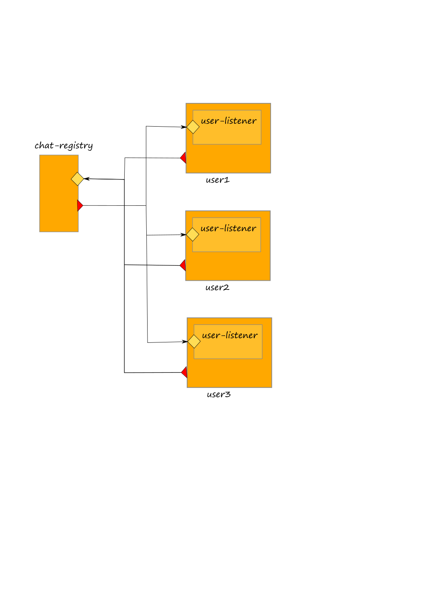

# Dynamic Binding

## Dynamic binding

Jolie allows output ports to be dynamically bound, i.e., their locations and protocols \(called _binding informations_\) can change at runtime. Such a feature is very important because it allows for the creation of dynamic systems where components \(microservices\) can be bound at runtime.


## Dynamic binding in Jolie

Technically, changes to the binding information of an output port is local to a behaviour instance: output ports are considered part of the local state of each instance. Dynamic binding is obtained by treating output ports as variables. For instance, the following would print the location and protocol name of output port `Printer`:

```jolie
// Printer.iol
interface PrinterInterface {
    OneWay: printText( string )
}

//dynamic_binding_example.ol

include "console.iol"
include "Printer.iol"

outputPort P {
    Location: "socket://127.0.0.1:80"
    Protocol: sodep
    Interfaces: PrinterInterface
}

main
{
    println@Console( P.location )();
    println@Console( P.protocol )()
}
```

Binding information may be entered at runtime by making simple assignments:

```jolie
include "Printer.iol"

outputPort P {
    Interfaces: PrinterInterface
}

main
{
    P.location = "socket://127.0.0.1:80/";
    P.protocol = "sodep"
}
```

## Example: programming a chat

We show a usage example of dynamic binding and binding transmission by implementing a a simple chat service. It is composed by a _Chat Registry_ which is in charge to manage all the open chats and participants, and a _User_ service which is in charge to manage a single participant connected to a chat. There are no limits to the users that can be connected to a chat. In the following diagram we report an example architecture where three users are connected to the _Chat Registry_ service.



The code can be consulted at this [link](https://github.com/jolie/examples/tree/master/02_basics/8_dynamicbinding).

Note that both the _Chat Registry_ and each _User_ service exhibit an inputPort for receiving messages. The outputPort of the _Chat Registry_ which points to the _User_ service is not bound to any service, but it needs to be bound dynamically depending on the users connected to a chat.

The _Chat Registry_ offers two operations: _addChat_ and _sendMessage_. The former operation permits to a user to connect to a chat, whereas the latter is exploited by the user to send messages to all the participants of a chat. The _User_ service is composed by two components: _user\_service.ol_ and _user.ol_. The former one is in charge to receive messages from the _Chat Registry_ whereas the latter just manages the console for enabling human interactions and sending local messages to the _Chat Registry_.

Dynamic binding is exploited in the implementation of the _sendMessage_ operation of the _Chat Registry_ where every time a message is received the outputPort _User_ is bound to each registered user for forwarding messages. Note that user's locations are stored into the hashmap _global.chat.\(  \).users.\(  \).location_ which is set everytime a user requests to be connected to a chat by using operation _addChat_.

```jolie
[ sendMessage( request )( response ) {
        /* validate token */
        if ( is_defined( global.tokens.( request.token ) ) ) {
            /* sending messages to all participants using dynamic binding */
            chat_name = global.tokens.( request.token ).chat_name;
            foreach( u : global.chat.( chat_name ).users ) {
                /* output port dynamic rebinding */
                User.location = global.chat.( chat_name ).users.( u ).location;
                /* message sending */
                if ( u != global.tokens.( request.token ).username ) {
                  with( msg ) {
                      .message = request.message;
                      .chat_name = chat_name;
                      .username = global.tokens.( request.token ).username
                  };
                  setMessage@User( msg )
                }
            }
        } else {
            throw( TokenNotValid )
        }
    }]
```

The operation _setMessage_ is exploited by the _Chat Registry_ to send a message to each participant of the chat. Note that such an operation is exhibited in the inputPort of the _user\_service.ol_ at the user side.

## Compatibility of the interfaces

It is worth noting that, in case of dynamic binding, the interfaces defined in the output port must be compatible with those defined into the receiving input port. The following rules must be respected for stating that there is compatibility between two interfaces:

* all the operations defined in the interfaces at the output ports must be declared also in the interfaces at the input port \(it does not matter in which interface an operation is defined, it is important that it is defined\).
* all the types of the messages defined for the operations of the output port, must be compatible with the the correspondat type of the same operation at the receiving input port.
* a sending message type is considered compatible with the correspondant receiving one, when all the message it represents can be received without producing a _TypeMismatch_ on the receiver part.

